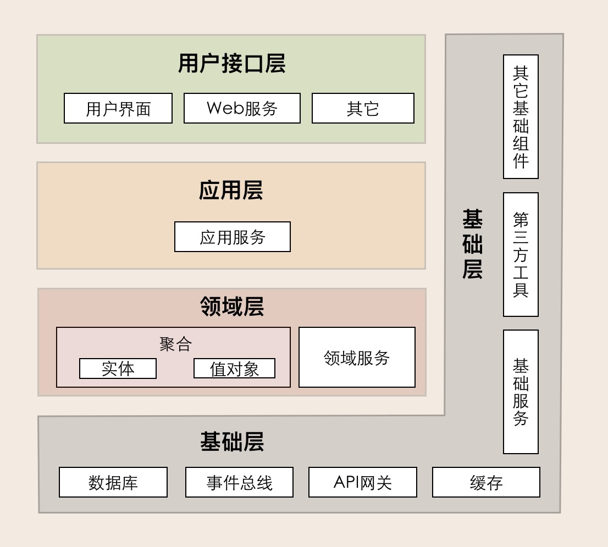
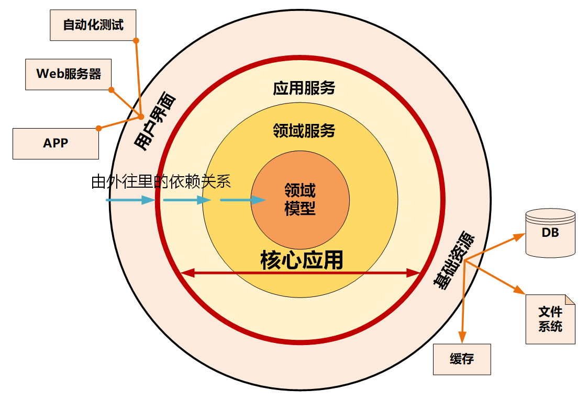
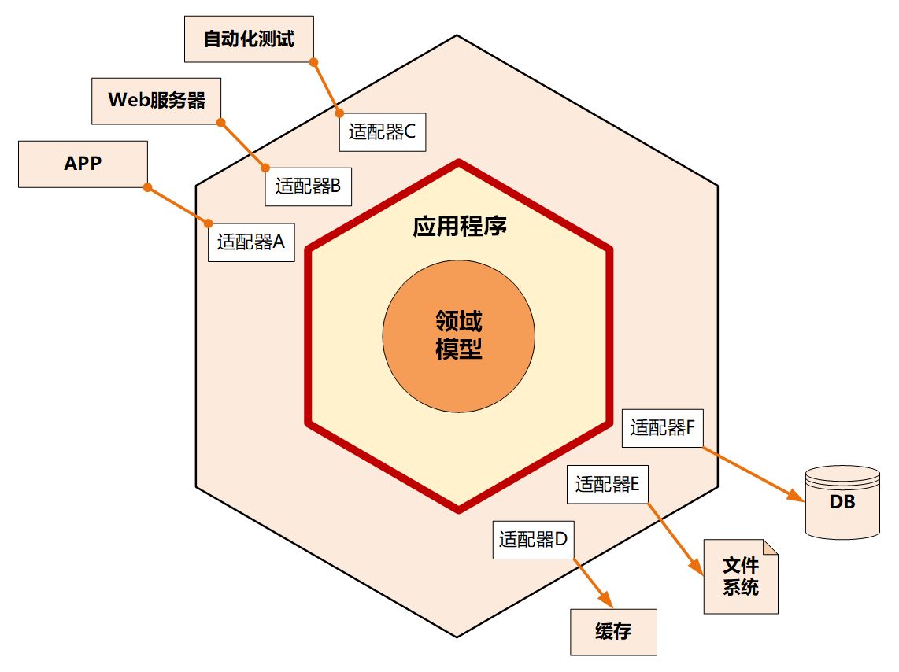
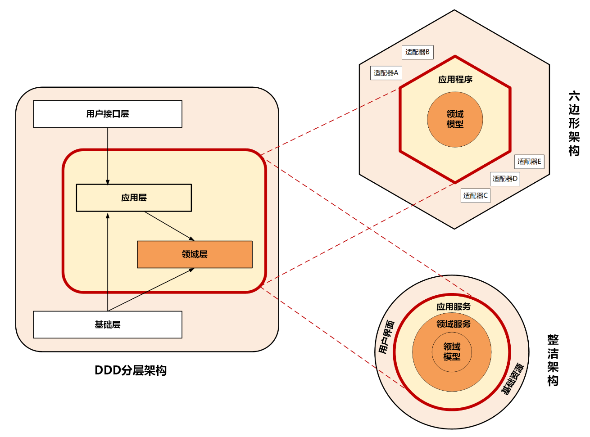

# ✅DDD的分层架构是怎么样的？

# 典型回答

DDD的分层架构是一个四层架构，从上到下依次是：用户接口层、应用层、领域层和基础层。

层次之间的调用关系是上层可以调用下层，即用户接口层可以调用应用层、领域层及基础层。应用层可以调用领域层和基础层，领域层可以调用基础层。

但是不能从下往上反向调用，各个层级之间是严格的单向调用的依赖关系。

除了这种简单的四层架构以外，DDD中还有比较典型的洋葱架构和六边形架构

洋葱架构，就是像洋葱一样的一层一层，从外到内的架构形式，如下图：

他的依赖关系是从外到内的。

六边形架构和洋葱架构有点像，只不过不是圆形，而是六边形的：

虽然 DDD 分层架构、整洁架构、六边形架构的架构模型表现形式不一样，但是这三种架构模型的设计思想都是微服务架构高内聚低耦合原则的完美体现，**都是以领域模型为中心的设计思想**。

本文图片参考自：《极客时间——DDD实战课》

> 更新: 2024-07-08 12:11:06  
> 原文: <https://www.yuque.com/hollis666/dr9x5m/mg5vy3rkg6on86m6>