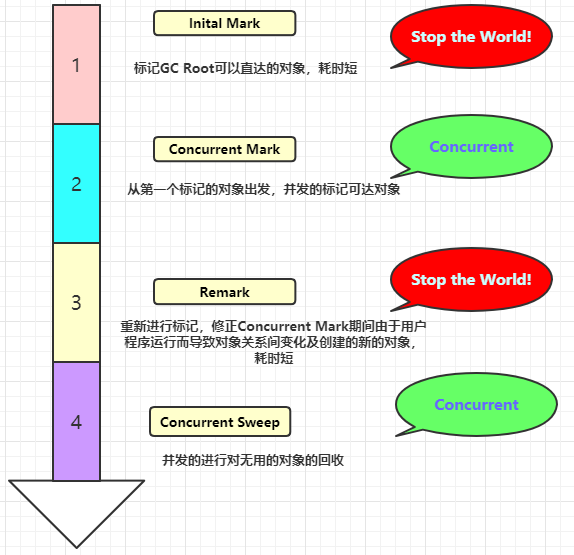

# ✅介绍下CMS的垃圾回收过程

CMS，Concurrent Mark Sweep，同样是**老年代的收集器**。他是一个并发执行的垃圾收集器，他更加关注垃圾回收的停顿时间，通过他的名字Concurrent Mark Sweep就可以知道，他采用的是耗时更短的`**标记-清除算法**`。

[✅说一说JVM的并发回收和并行回收](https://www.yuque.com/hollis666/dr9x5m/srfo2k1o2nq4dp7f)

CMS收集器的工作流程主要有下面4个步骤：

1. 初始标记：标记所有从GCRoot直接可达的对象。这一步骤需要STW，即暂停所有应用线程，但由于只标记直接可达的对象，因此这个阶段通常很快。
2. 并发标记：从初始标记阶段标记的对象出发，遍历整个对象图，标记所有可达的对象。在此阶段，GC线程与应用线程同时运行，不需要STW。（预清理：这一阶段也是并发执行的，目的是在实际清理前，处理并发标记阶段结束后和重新标记阶段开始前这段时间内发生的变化。目的是减少重新标记阶段的工作量。）
3. 重新标记：这一阶段是为了修正并发标记期间因应用线程继续运行而产生的更改。这是另一个需要STW的阶段。
4. 并发清理：在此阶段，GC线程清除不可达的对象，并回收它们占用的内存空间。这个阶段与应用线程并发执行，不需要STW。

> 以上这个过程其实就是三色标记法的过程：[https://www.yuque.com/hollis666/dr9x5m/lva8a9gfhagbrw2g](https://www.yuque.com/hollis666/dr9x5m/lva8a9gfhagbrw2g)
>

**从上面的四个步骤中可以看出，CMS的过程中，只有初始标记和重新标记这两个步骤是STW的，所以，相比其他的收集器整个回收过程都STW来说，他导致的应用停顿时间更短。**

优点:

1. 并发
2. 低停顿

缺点：

1. 对CPU非常敏感：在并发阶段虽然不会导致用户线程停顿，但是会因为占用了一部分线程使应用程序变慢
2. 无法处理**浮动垃圾**：在最后一步并发清理过程中，用户线程执行也会产生垃圾，但是这部分垃圾是在标记之后，所以只有等到下一次gc的时候清理掉，这部分垃圾叫浮动垃圾。
3. CMS使用“标记-清理”法会产生大量的**空间碎片**，当碎片过多，将会给大对象空间的分配带来很大的麻烦，往往会出现老年代还有很大的空间但无法找到足够大的连续空间来分配当前对象，不得不提前触发一次FullGC，为了解决这个问题CMS提供了一个开关参数，用于在CMS顶不住，要进行FullGC时开启内存碎片的合并整理过程，但是内存整理的过程是无法并发的，空间碎片没有了但是停顿时间变长了

# 扩展知识

[✅为什么初始标记和重新标记需要STW，而并发标记不需要？](https://www.yuque.com/hollis666/dr9x5m/acz9pk5h7waamrbe)

[✅什么是STW？有什么影响？](https://www.yuque.com/hollis666/dr9x5m/qg9fvqfnzpbd70hl)

> 更新: 2024-09-19 14:07:57  
> 原文: <https://www.yuque.com/hollis666/dr9x5m/lh75qbvh58o6xv8s>