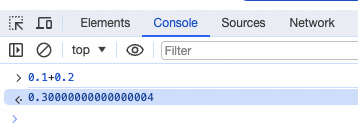
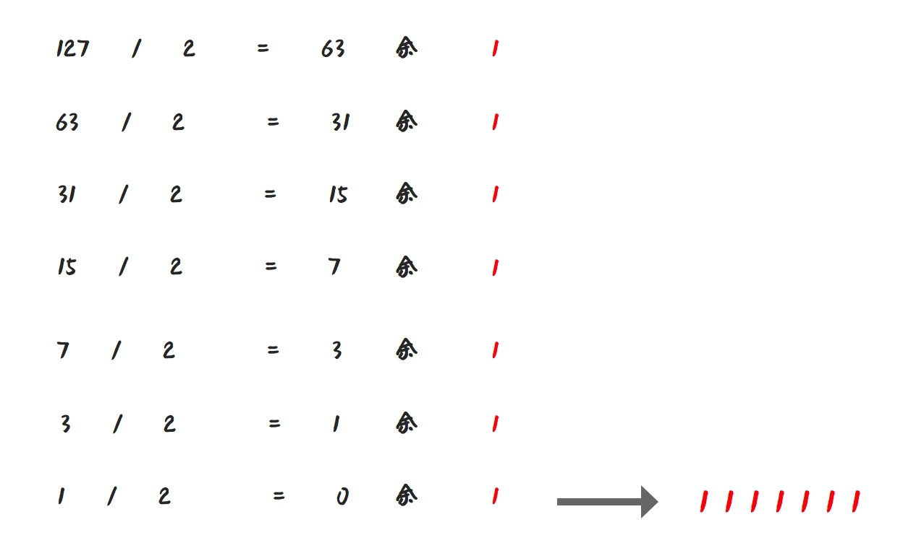
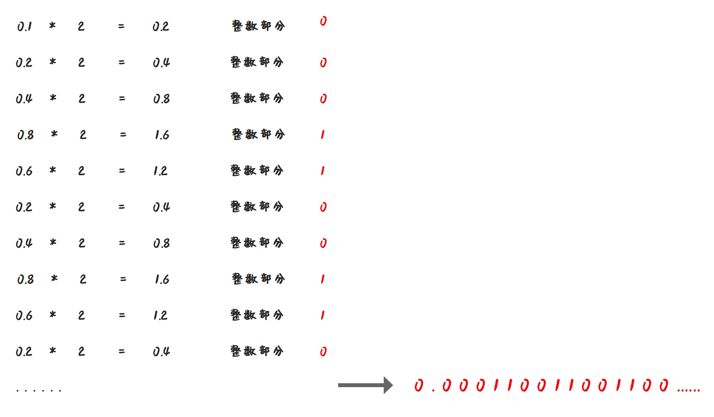
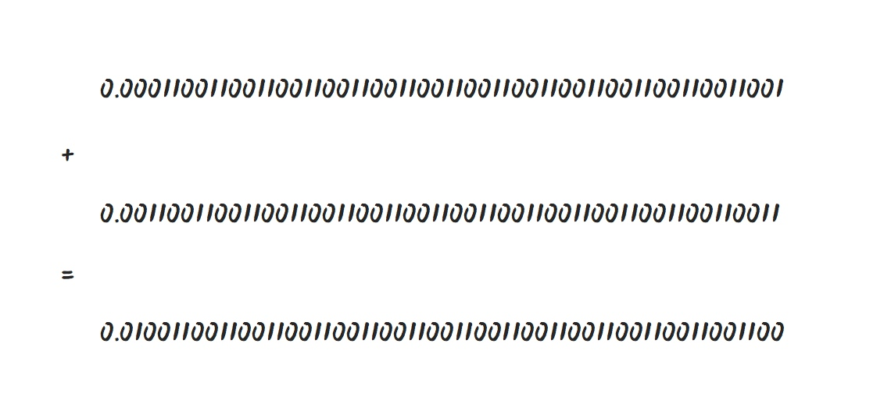

# ✅为什么不能用浮点数表示金额？

# 典型回答

因为不是所有的小数都能用二进制表示（扩展知识中介绍为啥不能表示），所以，为了解决这个问题，IEEE**提出了一种使用近似值表示小数的方式，并且引入了精度的概念。这就是我们所熟知的浮点数。**

****

比如0.1+0.2 != 0.3，而是等于0.30000000000000004 （甚至有一个网站就叫做 [https://0.30000000000000004.com/](https://0.30000000000000004.com/) ，就是来解释这个现象的）

****

**所以，浮点数只是近似值，并不是精确值，所以不能用来表示金额。否则会有精度丢失。**

# 扩展知识
### 十进制转二进制

首先我们看一下，**如何把十进制整数转换成二进制整数？**

十进制整数转换为二进制整数采用"除2取余，逆序排列"法。

具体做法是：

+ 用2整除十进制整数，可以得到一个商和余数；
+ 再用2去除商，又会得到一个商和余数，如此进行，直到商为小于1时为止
+ 然后把先得到的余数作为二进制数的低位有效位，后得到的余数作为二进制数的高位有效位，依次排列起来。

如，我们想要把127转换成二进制，做法如下：

那么，**十进制小数转换成二进制小数，又该如何计算呢？**

十进制小数转换成二进制小数采用"乘2取整，顺序排列"法。

具体做法是：

+ 用2乘十进制小数，可以得到积
+ 将积的整数部分取出，再用2乘余下的小数部分，又得到一个积
+ 再将积的整数部分取出，如此进行，直到积中的小数部分为零，此时0或1为二进制的最后一位。或者达到所要求的精度为止。

所以，十进制的0.625对应的二进制就是0.101。

### 不是所有数都能用二进制表示

我们知道了如何将一个十进制小数转换成二进制，那么是不是计算就可以直接用二进制表示小数了呢？

前面我们的例子中0.625是一个特列，那么还是用同样的算法，请计算下0.1对应的二进制是多少？

我们发现，0.1的二进制表示中出现了无限循环的情况，也就是(0.1)10 = (0.000110011001100…)2

这种情况，计算机就没办法用二进制精确的表示0.1了。

**也就是说，对于像0.1这种数字，我们是没办法将他转换成一个确定的二进制数的。**

### IEEE 754

为了解决部分小数无法使用二进制精确表示的问题，于是就有了IEEE 754规范。

IEEE二进制浮点数算术标准（IEEE 754）是20世纪80年代以来最广泛使用的浮点数运算标准，为许多CPU与浮点运算器所采用。

> 浮点数和小数并不是完全一样的，计算机中小数的表示法，其实有定点和浮点两种。因为在位数相同的情况下，定点数的表示范围要比浮点数小。所以在计算机科学中，使用浮点数来表示实数的近似值。
>

IEEE 754规定了四种表示浮点数值的方式：单精确度（32位）、双精确度（64位）、延伸单精确度（43比特以上，很少使用）与延伸双精确度（79比特以上，通常以80位实现）。

其中最常用的就是32位单精度浮点数和64位双精度浮点数。

**IEEE并没有解决小数无法精确表示的问题，只是提出了一种使用近似值表示小数的方式，并且引入了精度的概念。**

浮点数是一串0和1构成的位序列(bit sequence)，从逻辑上用三元组{S,E,M}表示一个数N,如下图所示：

+ S(sign)表示N的符号位。对应值s满足：n>0时，s=0; n≤0时，s=1。
+ E(exponent)表示N的指数位，位于S和M之间的若干位。对应值e值也可正可负。
+ M(mantissa)表示N的尾数位，恰好，它位于N末尾。M也叫有效数字位（significand）、系数位（coefficient）, 甚至被称作"小数"。

则浮点数N的实际值n由下方的式子表示：

上面这个公式看起来很复杂，其中符号位和尾数位还比较容易理解，但是这个指数位就不是那么容易理解了。

其实，大家也不用太过于纠结这个公式，大家只需要知道对于单精度浮点数，最多只能用32位字符表示一个数字，双精度浮点数最多只能用64位来表示一个数字。

**而对于那些无限循环的二进制数来说，计算机采用浮点数的方式保留了一定的有效数字，那么这个值只能是近似值，不可能是真实值。**

至于一个数对应的IEEE 754浮点数应该如何计算，不是本文的重点，这里就不再赘述了，过程还是比较复杂的，需要进行对阶、尾数求和、规格化、舍入以及溢出判断等。

但是这些其实不需要了解的太详细，我们只需要知道，小数在计算机中的表示是近似数，并不是真实值。根据精度不同，近似程度也有所不同。

如0.1这个小数，他对应的在双精度浮点数的二进制为：0.00011001100110011001100110011001100110011001100110011001 。

0.2这个小数0.00110011001100110011001100110011001100110011001100110011 。

所以两者相加：

转换成10进制之后得到：0.30000000000000004！

### 避免精度丢失

在Java中，使用float表示单精度浮点数，double表示双精度浮点数，表示的都是近似值。

所以，在Java代码中，千万不要使用float或者double来进行高精度运算，尤其是金额运算，否则就很容易产生资损问题。

为了解决这样的精度问题，Java中提供了BigDecimal来进行精确运算。

> 更新: 2024-07-08 12:11:57  
> 原文: <https://www.yuque.com/hollis666/dr9x5m/vmrkz84g8c6ypu5s>