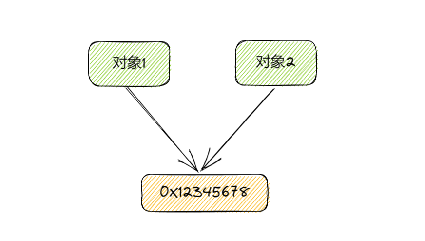
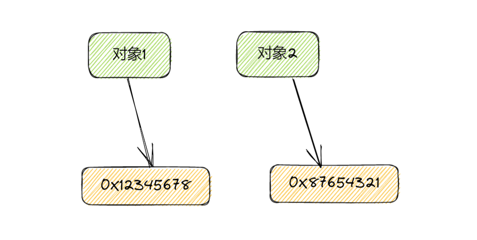

# ✅什么是深拷贝和浅拷贝？

# 典型回答


在计算机内存中，每个对象都有一个地址，这个地址指向对象在内存中存储的位置。当我们使用变量引用一个对象时，实际上是将该对象的地址赋值给变量。因此，如果我们将一个对象复制到另一个变量中，实际上是将对象的地址复制到了这个变量中。


**浅拷贝是指将一个对象复制到另一个变量中，但是只复制对象的地址，而不是对象本身。也就是说，原始对象和复制对象实际上是共享同一个内存地址的。**因此，如果我们修改了复制对象中的属性或元素，原始对象中对应的属性或元素也会被修改。





在Java中，我们常用的各种BeanUtils基本也都是浅拷贝的。


> 适用场景：浅拷贝的好处就是性能比较好，他只需要做一个引用的地址复制即可。当我们希望不同的对象，如对象1和对象2共享部分数据的时候，可以使用浅拷贝。或者对于一些简单的对象，比如没有很复杂的对象嵌套时，就可以用浅拷贝。
>


**深拷贝是指将一个对象及其所有子对象都复制到另一个变量中，也就是说，它会创建一个全新的对象，并将原始对象中的所有属性或元素都复制到新的对象中。**因此，如果我们修改复制对象中的属性或元素，原始对象中对应的属性或元素不会受到影响。





比如我们有一个User类，然后他的定义如下：


```plain
class User {
    private String name;
    private String password;
    private Address address;
    //省略构造函数和setter/getter
}

public class Address {
    private String province;
    private String city;
    private String area;
    //省略构造函数和setter/getter
}


```


当我们基于User类的一个对象user1拷贝出一个新的对象user2的时候，不管怎么样，user1和user2都是两个不同的对象，他们的地址也不会一样。但是其中的成员变量Address的话可能就因为深浅拷贝的不同而呈现不同的现象了。


如果是浅拷贝，那么user2中的address会和user1中的address共享同一个地址，当其中一个修改时，另一个也会受影响。


如果是深拷贝，那么user2中的address会和user1中的address并不是同一个地址，当其中一个修改时，另一个是不会受影响的。


> 适用场景：深拷贝的好处就是两个对象完全隔离。当我们需要完全独立的对象副本，且原始对象和副本之间的操作互不影响时，深拷贝是必须的。对于包含嵌套对象或复杂引用关系的对象，通常需要深拷贝以确保所有层级的数据都被复制。
>

# 扩展知识


## BeanUtils的浅拷贝


我们举个实际例子，来看下为啥前面说BeanUtils.copyProperties的过程是浅拷贝。


先来定义两个类：


```plain
public class Address {
    private String province;
    private String city;
    private String area;
    //省略构造函数和setter/getter
}

class User {
    private String name;
    private String password;
    private Address address;
    //省略构造函数和setter/getter
}
```


然后写一段测试代码：


```plain
User user = new User("Hollis", "hollischuang");
user.setAddress(new Address("zhejiang", "hangzhou", "binjiang"));

User newUser = new User();
BeanUtils.copyProperties(user, newUser);

System.out.println(user == newUser);
System.out.println(user.getAddress() == newUser.getAddress());
```


以上代码输出结果为：


```plain
false
true
```


即，我们BeanUtils.copyProperties拷贝出来的newUser是一个新的对象，但是，其中的address对象和原来的user中的address对象是同一个对象。


如果我们修改newUser中的Address对象的值的话，是会同时把user对象中的Address的值也修改了的。可以尝试着修改下newUser中的address对象：


```plain
newUser.getAddress().setCity("shanghai");
System.out.println(JSON.toJSONString(user));
System.out.println(JSON.toJSONString(newUser));
```


输出结果：


```plain
{"address":{"area":"binjiang","city":"shanghai","province":"zhejiang"},"name":"Hollis","password":"hollischuang"}
{"address":{"area":"binjiang","city":"shanghai","province":"zhejiang"},"name":"Hollis","password":"hollischuang"}
```

## 
## 实现深拷贝


如何实现深拷贝呢，主要有以下几个方法：


### 实现Cloneable接口，重写clone()


在Object类中定义了一个clone方法，这个方法其实在不重写的情况下，其实也是浅拷贝的。

如果想要实现深拷贝，就需要重写clone方法，而想要重写clone方法，就必须实现Cloneable，否则会报CloneNotSupportedException异常。


将上述代码修改下，重写clone方法：


```plain
public class Address implements Cloneable{
    private String province;
    private String city;
    private String area;
    //省略构造函数和setter/getter

    @Override
    public Object clone() throws CloneNotSupportedException {
        return super.clone();
    }
}

class User implements Cloneable{
    private String name;
    private String password;
    private Address address;
    //省略构造函数和setter/getter

    @Override
    protected Object clone() throws CloneNotSupportedException {
        User user = (User)super.clone();
        user.setAddress((Address)address.clone());
        return user;
    }
}
```


之后，在执行一下上面的测试代码，就可以发现，这时候newUser中的address对象就是一个新的对象了。


这种方式就能实现深拷贝，但是问题是如果我们在User中有很多个对象，那么clone方法就写的很长，而且如果后面有修改，在User中新增属性，这个地方也要改。


那么，有没有什么办法可以不需要修改，一劳永逸呢？


### 序列化实现深拷贝


我们可以借助序列化来实现深拷贝。先把对象序列化成流，再从流中反序列化成对象，这样就一定是新的对象了。

序列化的方式有很多，比如我们可以使用各种JSON工具，把对象序列化成JSON字符串，然后再从字符串中反序列化成对象。


如使用fastjson实现：


```plain
User newUser = JSON.parseObject(JSON.toJSONString(user), User.class);
```


也可实现深拷贝。


除此之外，还可以使用Apache Commons Lang中提供的SerializationUtils工具实现。


我们需要修改下上面的User和Address类，使他们实现Serializable接口，否则是无法进行序列化的。


```plain
class User implements Serializable
class Address implements Serializable
```


然后在需要拷贝的时候：

```plain
User newUser = (User) SerializationUtils.clone(user);
```


同样，也可以实现深拷贝啦~！


> 更新: 2024-07-08 12:11:15  
> 原文: <https://www.yuque.com/hollis666/dr9x5m/br3qgdim5xz2pngx>