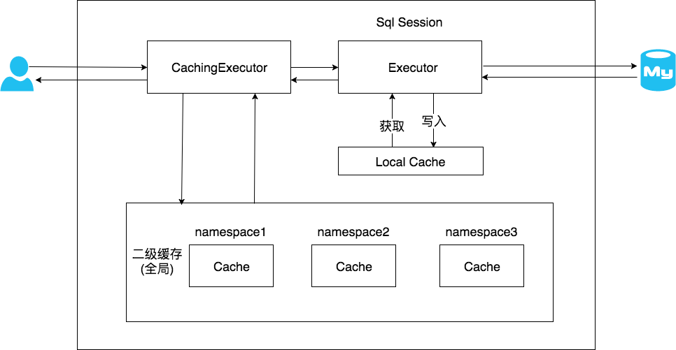

# ✅Mybatis的缓存机制

# 典型回答
Mybatis的缓存机制有两种：一级缓存和二级缓存。Mybatis缓存的整体工作原理可以参考这篇文章

[✅Mybatis的工作原理？](https://www.yuque.com/hollis666/dr9x5m/rf9y4p#ChWfe)

## 一级缓存
在同一个会话中，Mybatis会将执行过的SQL语句的结果缓存到内存中，下次再执行相同的SQL语句时，会先查看缓存中是否存在该结果，如果存在则直接返回缓存中的结果，不再执行SQL语句。一级缓存是默认开启的，可以通过在Mybatis的配置文件中设置禁用或刷新缓存来控制缓存的使用。

工作流程如下：

对于一级缓存，有两点需要注意的是：

1. MyBatis一级缓存内部设计简单，只是一个没有容量限定的HashMap，在缓存的功能性上有所欠缺。
2. MyBatis的一级缓存最大范围是SqlSession内部，有多个SqlSession或者分布式的环境下，数据库写操作会引起脏数据，换句话说，当一个SqlSession查询并缓存结果后，另一个SqlSession更新了该数据，其他缓存结果的SqlSession是看不到更新后的数据的。所以建议设定缓存级别为Statement。

## 二级缓存
二级缓存是基于命名空间的缓存，它可以跨会话，在多个会话之间共享缓存，可以减少数据库的访问次数。要使用二级缓存，需要在Mybatis的配置文件中配置相应的缓存实现类，并在需要使用缓存的Mapper接口上添加`@CacheNamespace`注解。二级缓存的使用需要注意缓存的更新和失效机制，以及并发操作的问题。

工作流程如下：

因为二级缓存是基于namespace的，所以一般情况下，Mybatis的二级缓存是不适合多表查询的情况的。举个例子：

我们有两个表：student和class，我们为这两个表创建了两个namespace去对这两个表做相关的操作。同时，为了进行多表查询，我们在namespace=student的空间中，对student和class两张表进行了关联查询操作（sqlA）。此时就会在namespace=student的空间中把sqlA的结果缓存下来，如果我们在namespace=class下更新了class表，namespace=student是不会更新的，这就会导致脏数据的产生。

## 不建议用

  
如前面介绍的，MyBatis 的二级缓存是一个功能强大的特性，它可以显著提高应用性能。but，他会带来数据一致性问题。即数据库发生了变化，但是缓存还是旧数据的情况。

所以，平时在工作中直接用Mybatis的二级缓存的场景会比较少。如果要用缓存，还不如直接用第三方的缓存，至少我们明确地知道这里有个缓存，而不是像Mybatis一样，可能开发者忽略了这里的缓存，导致出了问题不好排查。

**如果我们使用第三方缓存解决方案**，如 Redis、Memcached、以及应用层面的Guava，Caffeine等。这些工具提供了更强大的缓存功能，重要的是提供了更灵活的缓存策略和更精细的控制。

<u>当然也不是完全不能用，在读多写少的场景也可以用。</u>  

> 更新: 2024-07-08 12:12:08  
> 原文: <https://www.yuque.com/hollis666/dr9x5m/mapxqi>