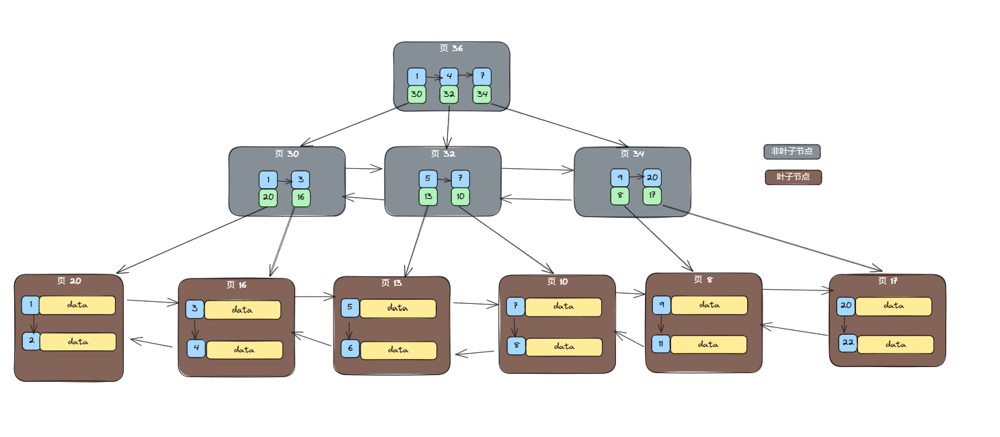

# ✅InnoDB为什么使用B+树实现索引？

# 典型回答

首先看看B+树有哪些特点：

1. B+树是一棵**平衡树**，每个叶子节点到根节点的路径长度相同，查找效率较高；
2. B+树的**所有关键字都在叶子节点上**，因此范围查询时只需要遍历一遍叶子节点即可；
3. B+树的叶子节点都按照关键字大小**顺序存放**，因此可以快速地支持按照关键字大小进行排序；
4. B+树的**非叶子节点不存储实际数据**，因此可以存储更多的索引数据；
5. B+树的非叶子节点使用指针连接子节点，因此可以快速地支持范围查询和倒序查询。
6. **B+树的叶子节点之间通过双向链表链接**，方便进行范围查询。

那么，使用B+树实现索引，就有以下几个优点：

1. **支持范围查询**，B+树在进行范围查找时，只需要从根节点一直遍历到叶子节点，因为数据都存储在叶子节点上，而且叶子节点之间有指针连接，可以很方便地进行范围查找。
2. **支持排序**，B+树的叶子节点按照关键字顺序存储，可以快速支持排序操作，提高排序效率；
3. **存储更多的索引数据**，因为它的非叶子节点只存储索引关键字，不存储实际数据，因此可以存储更多的索引数据；
4. **在节点分裂和合并时，IO操作少**。B+树的叶子节点的大小是固定的，而且节点的大小一般都会设置为一页的大小，这就使得节点分裂和合并时，IO操作很少，只需读取和写入一页。
5. **有利于磁盘预读**。由于B+树的节点大小是固定的，因此可以很好地利用磁盘预读特性，一次性读取多个节点到内存中，这样可以减少IO操作次数，提高查询效率。
6. **有利于缓存**。B+树的非叶子节点只存储指向子节点的指针，而不存储数据，这样可以使得缓存能够容纳更多的索引数据，从而提高缓存的命中率，加快查询速度。

# 扩展知识

## 为什么不用红黑树或者B树？

因为B+树的特点是只有叶子节点存储数据，而非叶子节点不存储数据，并且节点大小固定，还有就是叶子结点之间通过双向链表链接的，所以，使用B+树实现索引有很多好处，比如我们前面提到的支持范围查询、有利于磁盘预读、有利于优化排序等等。而这些是红黑树和B树做不到的。

## B+树索引和Hash索引有什么区别？

B+ 树索引和哈希索引是常见的数据库索引结构，它们有以下几个主要区别：

B+ 树索引将索引列的值按照大小排序后存储，因此**B+ 树索引适合于范围查找和排序操作**；而哈希索引是将索引列的值通过哈希函数计算后得到一个桶的编号，然后将桶内的记录保存在一个链表或者树结构中。因此，**哈希索引适合于等值查询，但不适合范围查询和排序操作。**

B+ 树索引在插入和删除数据时需要调整索引结构，这个过程可能会涉及到页分裂和页合并等操作，**因此B+ 树索引的维护成本比较高**；而哈希索引在插入和删除数据时只需要计算哈希值并插入或删除链表中的记录，**因此哈希索引的维护成本相对较低。**

**B+ 树索引在磁盘上是有序存储的**，因此在进行区间查询时可以利用磁盘预读的优势提高查询效率；而**哈希索引在磁盘上是无序存储的**，因此在进行区间查询时可能会需要随机访问磁盘，导致查询效率降低。

B+ 树索引在节点中存储多个键值对，因此可以充分利用磁盘块的空间，提高空间利用率；而哈希索引由于需要存储哈希值和指针，因此空间利用率相对较低。

> 更新: 2024-07-08 12:11:51  
> 原文: <https://www.yuque.com/hollis666/dr9x5m/uh3cy1>