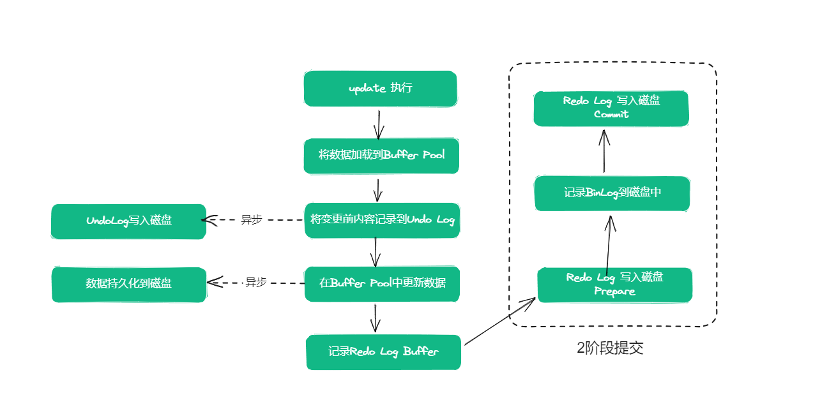

# ✅InnoDB的一次更新事务过程是怎么样的？

# 典型回答

一次InnnoDB的update操作，涉及到BufferPool、BinLog、UndoLog、RedoLog以及物理磁盘，完整的一次操作过程基本如下：

1、在Buffer Pool中读取数据：当InnoDB需要更新一条记录时，首先会在Buffer Pool中查找该记录是否在内存中。如果没有在内存中，则从磁盘读取该页到Buffer Pool中。

2、记录UndoLog：在修改操作前，InnoDB会在Undo Log中记录修改前的数据。Undo Log是用来保证事务原子性和一致性的一种机制，用于在发生事务回滚等情况时，将修改操作回滚到修改前的状态，以达到事务的原子性和一致性。UndoLog的写入最开始写到内存中的，然后由1个后台线程定时刷新到磁盘中的。

3、在Buffer Pool中更新：当执行update语句时，InnoDB会先更新已经读取到Buffer Pool中的数据，而不是直接写入磁盘。同时，InnoDB会将修改后的数据页状态设置为“脏页”（Dirty Page）状态，表示该页已经被修改但尚未写入磁盘。

4、记录RedoLog Buffer：InnoDB在Buffer Pool中记录修改操作的同时，InnoDB 会先将修改操作写入到 redo log buffer 中。

5、提交事务：在执行完所有修改操作后，事务被提交。在提交事务时，InnoDB会将Redo Log写入磁盘，以保证事务持久性。

6、写入磁盘：在提交过程后，InnoDB会将Buffer Pool中的脏页写入磁盘，以保证数据的持久性。但是这个写入过程并不是立即执行的，是有一个后台线程异步执行的，所以可能会延迟写入，总之就是MYSQL会选择合适的时机把数据写入磁盘做持久化。

7、记录Binlog：在提交过程中，InnoDB会将事务提交的信息记录到Binlog中。Binlog是MySQL用来实现主从复制的一种机制，用于将主库上的事务同步到从库上。在Binlog中记录的信息包括：事务开始的时间、数据库名、表名、事务ID、SQL语句等。

需要注意的是，在binlog和redolog的写入过程中，其实是分成了2阶段的，通过2阶段提交的方式来保证一致性的。

# 扩展知识

## 二阶段提交

[✅什么是事务的2阶段提交？](https://www.yuque.com/hollis666/dr9x5m/geuks1bbiwd39h1r)

> 更新: 2024-12-18 20:11:08  
> 原文: <https://www.yuque.com/hollis666/dr9x5m/wmmyt7a9vr7qlwsl>