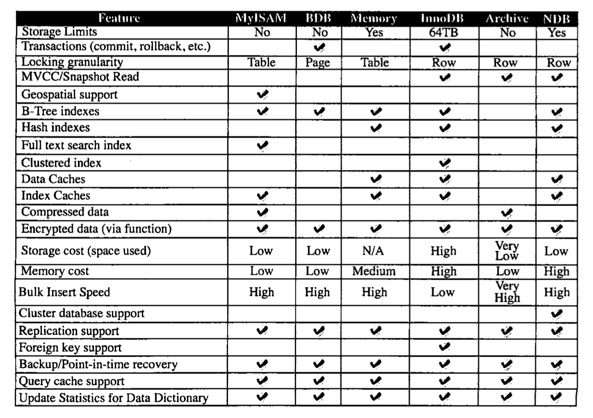

# ✅MySQL的数据存储一定是基于硬盘的吗？

# 典型回答

不是的，MySQL也可以基于内存的，即MySQL的内存表技术。它允许将数据和索引存储在内存中，从而提高了检索速度和修改数据的效率。优点包括具有快速响应的查询性能和节约硬盘存储空间。此外，使用内存表还可以实现更高的复杂性，从而提高了MySQL的整体性能。

创建内存表与创建普通表一样，使用CREATE TABLE语句，但需要将存储引擎设置为：ENGINE = MEMORY

# 扩展知识
## 什么是数据库存储引擎？

数据库引擎是用于存储、处理和保护数据的核心服务。利用数据库引擎可控制访问权限并快速处理事务，从而满足企业内大多数需要处理大量数据的应用程序的要求。

使用数据库引擎创建用于联机事务处理或联机分析处理数据的关系数据库。这包括创建用于存储数据的表和用于查看、管理和保护数据安全的数据库对象（如索引、视图和存储过程）。

查看mysql当前使用什么存储引擎:show engines;

查看mysql当前默认的存储引擎:show variables like '%storage_engine%';

查看看某个表用了什么引擎:show create table 表名;，在显示结果里参数engine后面的就表示该表当前用的存储引擎

### MySQL的存储引擎是基于表的还是基于数据库的？
表

### MySQL中如何指定引擎
1、创建表时，可以通过ENGINE来指定存储引擎，在create语句最后加上“engine=存储引擎;”即可；

create table table1(id int(11) primary key auto_increment)engine=MyISAM; 

2、修改表时，可以使用“alter table 表名 engine=存储引擎;”来指定存储引擎。

alter table table1 engine=InnoDB; 

## MySQL支持哪几种执行引擎，有什么区别

MySQL是开源的，我们可以基于其源码编写我们自己的存储引擎，有以下几种存储引擎

MyISAM、InnoDB、NDB、MEMORY，Archieve、Fedarated以及Maria等。对比如下：

## Innodb和MyISAM有什么区别？

[✅InnoDB和MyISAM有什么区别？](https://www.yuque.com/hollis666/dr9x5m/adeg5m)

> 更新: 2024-07-08 12:11:55  
> 原文: <https://www.yuque.com/hollis666/dr9x5m/wgqvpgmmezluxuzc>