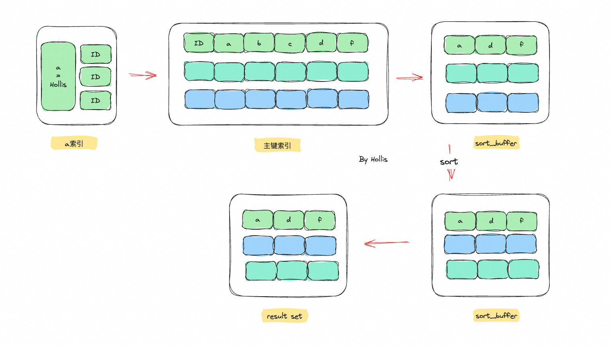

# ✅order by 是怎么实现的？

# 典型回答


order by 是做排序的，具体怎么排取决于优化器的选择，如果优化器认为走索引更快，那么就会用索引排序，否则，就会使用filesort (执行计划中extra中提示：using filesort），但是能走索引排序的情况并不多，并且确定性也没有那么强，很多时候，还是走的filesort。


filesort这种排序方式中，如果需要排序的内容比较少，就会基于内存中的sort_buffer，否则就需要使用临时文件进行排序了。并且在实际排序过程中，如果字段长度并不是特别长，那么就会使用全字段排序的方式直接在sort_buffer中排序后返回结果集。如果字段长度特别长，那么就可能基于空间考虑，采用row_id排序，这样就会在排序后进行二次回表后返回结果集。


## 索引排序


我们都知道，索引是天然有序的，所以当我们在使用order by的时候，如果能借助索引，那么效率一定是最高的。


并且MySQL确实也可以基于索引进行order by的查询，但是这个过程是否一定用索引，完全取决于优化器的选择。


```plain
 CREATE TABLE `t2` (          
  `id` INT(11),
  `a` varchar(64) NOT NULL,                                                                                                                                                          
  `b` varchar(64) NOT NULL,                                                                                                                                                          
  `c` varchar(64) NOT NULL,                                                                                                                                                          
  `d` varchar(64) NOT NULL,                                                                                                                                                          
  `f` varchar(64) DEFAULT NULL,    
  PRIMARY KEY(id),
  UNIQUE KEY `f` (`f`),                                                                                                                                                              
  KEY `idx_abc` (`a`,`b`,`c`)         
  KEY `idx_a` (`a`)    
) ENGINE=InnoDB DEFAULT CHARSET=latin1
```


假设有以上这样一张表，在排序时，**可能**出现的情况如下（因为有优化器的干预，以下结果并不一定可以100%复现。我自己实验的时候是可以的，我的环境是MySQL 5.7，）：


```plain
select * from t2 order by a;

-- 不走索引，使用filesort（后面介绍啥是filesort）


select * from t2 order by a limit 100;

-- 走索引


select a,b from t2 order by a limit 100;

-- 走索引


select a,b,c from t2 order by a;

-- 走索引


select a,b,c,d from t2 order by a;

-- 不走索引，使用filesort


select a,b,c,d from t2 where a = "Hollis" order by b;

-- 走索引


select a,b,c,d from t2 where b = "Hollis" order by a;

-- 不走索引，使用filesort

```


也就是说，当我们使用索引字段进行排序的时候，优化器会根据成本评估选择是否通过索引进行排序。经过我的不断验证，以下几种情况，走索引的概率很高：


+ 查询的字段和order by的字段组成了一个联合索引，并且查询条件符合最左前缀匹配，查询可以用到索引覆盖。如`select a,b,c from t2 order by a;`
+ 查询条件中有limit，并且limit的数量并不高。（我测试的表数据量80万，在limit超过2W多的时候就不走索引了），如`order by a limit 100`
+ 虽然没有遵循最左前缀匹配，但是前导列通过常量进行查询，如` where a = "Hollis" order by b`


## filesort 排序


如果不能使用或者优化器认为索引排序效率不高时， MySQL 会执行filesort操作以读取表中的行并对它们进行排序。


在进行排序时，MySQL 会给每个线程分配一块内存用于排序，称为 sort_buffer，它的大小是由`<font style="color:rgb(48, 48, 48);">sort_buffer_size</font>`<font style="color:rgb(48, 48, 48);">控制的。</font>

<font style="color:rgb(48, 48, 48);"></font>

而根据`sort_buffer_size`的大小不同，会在不同的地方进行排序操作：

+ 如果要排序的数据量小于 `sort_buffer_size`，那么排序就在**内存**中完成。
+ 如果排序数据量大于`sort_buffer_size`，则需要利用**磁盘临时文件**辅助排序。


> 临时文件排序采用归并排序的算法，首先会把需要排序的数据拆分到多个临时文件里同步进行排序操作，然后把多个排好序的文件合并成一个结果集返回给客户端。
>
> 在磁盘上的临时文件里排序相对于在内存中的sort buffer里排序来说，会慢很多。
>


除了`sort_buffer_size`参数以外，影响排序的算法的还有一个关键参数：`max_length_for_sort_data`


`<font style="color:rgb(51, 51, 51);">max_length_for_sort_data</font>`<font style="color:rgb(51, 51, 51);">是 MySQL</font> 中控制<用于排序的行数据的长度>的一个参数，默认值是1024字节。如果单行的长度超过这个值，MySQL就认为单行太大，那么就会采用**<font style="color:rgb(51, 51, 51);">rowid 排序</font>**<font style="color:rgb(51, 51, 51);">，否则就进行</font>**<font style="color:rgb(51, 51, 51);">全字段排序</font>**<font style="color:rgb(51, 51, 51);">。</font>

<font style="color:rgb(51, 51, 51);"></font>

### <font style="color:rgb(51, 51, 51);">全字段排序</font>


所谓全字段排序，就是将要查询的所有字段都放到sort_buffer中，然后再根据排序字段进行排序，排好之后直接把结果集返回给客户端。


假如我们有如下查询SQL：


```plain
select a,d,f from t2 where a = "Hollis" order by d;

-- 
```


因为这里涉及到的字段有a,d,f三个，那么就会把符合where条件的所有数据的a,d,f字段都放到sort_buffer中，然后再在sort_buffer中根据d进行排序，排好之后返回给客户端。大致过程如下：


1、从索引a中取出 a = "Hollis"的第一条记录的主键ID

2、根据主键ID回表，取出a,d,f三个字段，存入sort_buffer

3、继续查询下一个符合a = "Hollis"的记录，重读第1-2步骤

4、在sort_buffer中，根据d进行排序

5、将排序后的结果集返回给客户端





以上过程中，如果数据sort buffer放不下了，就会采用临时文件，然后再对临时文件进行归并排序。


全字段排序的好处就是只对原表进行了一次回表查询（每条记录只需要回表一次），之后的排序好以后就可以直接把需要的字段返回了。所以他的效率比较高。但是他的缺点就是，如果要查询的字段比较多，那么就会比较耗费sort_buffer的空间，使得空间中能存储的数据很少。那么如果要排序的数据量变大，就会要用到临时文件，导致整体的性能下降。


那么，为了避免这个问题，也可以通过row_id排序的方式。


### row_id 排序


这个也比较容易理解，就是说我们在构建sort_buffer的时候，不要把所有的要查询字段都放进去，只把排序字段这主键放进去就行了。


```plain
select a,d,f from t2 where a = "Hollis" order by d;
```


比如这个SQL，那么只需要把d和id放到sort_buffer中，先按照d进行排序。排好之后，就在根据id，把对应的a,d,f几个字段都查询出来，返回给客户端即可。大致过程如下：


1、从索引a中取出 a = "Hollis"的第一条记录的主键ID

2、根据主键ID回表，取出d这一个字段，存入sort_buffer

3、继续查询下一个符合a = "Hollis"的记录，重读第1-2步骤

4、在sort_buffer中，根据d进行排序

<u>5、再根据ID，回表查询出a,d,f几个字段</u>

6、将结果集返回给客户端


以上的第五步，就是比全字段排序算法中多出来的一步，可以看到，这个方案多了一次回表。所以他的效率肯定也要更慢一些。


### 如何选择


其实，row_id是MySQL的一种优化算法，他会优先考虑使用全字段排序，只有在他认为字段长度过长，可能会影响效率时，采用row_id的方式排序。并且，能用sort_buffer搞定的情况，MySQL就不会采用临时文件。


总之就是，速度优先，内存优先、一次回表优先。  


> 更新: 2024-07-08 12:11:58  
> 原文: <https://www.yuque.com/hollis666/dr9x5m/caou56>