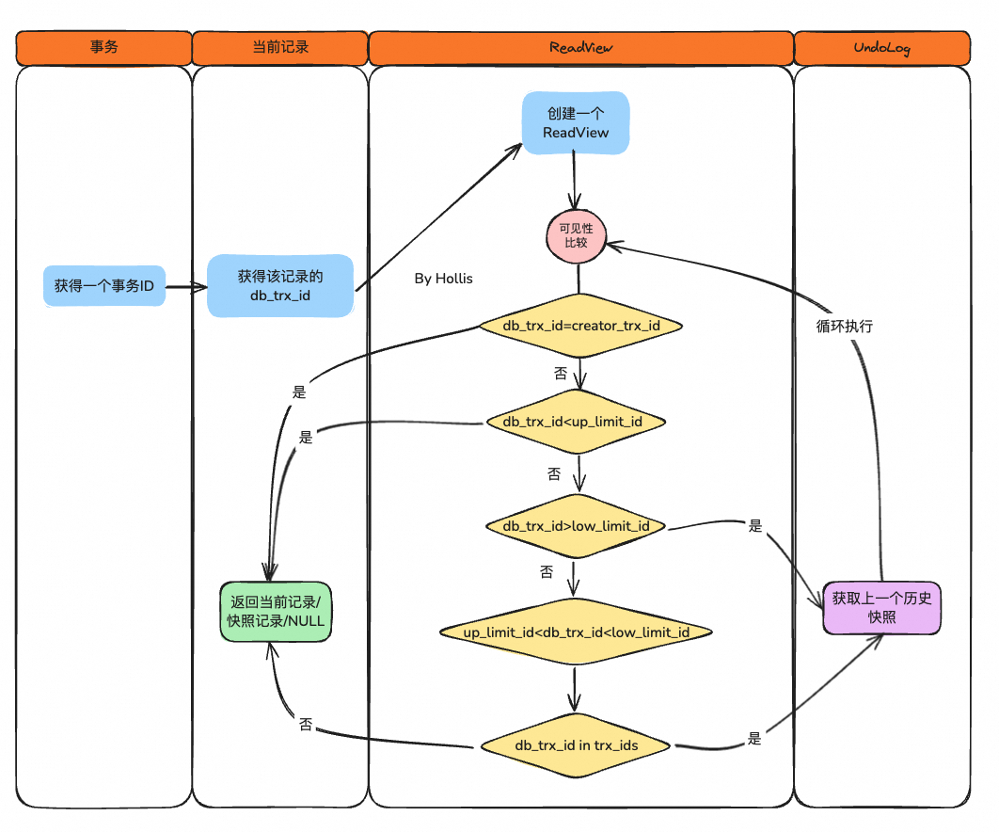

# ✅如何理解MVCC？

# 典型回答


MVCC，是Multiversion Concurrency Control的缩写，翻译过来是多版本并发控制，和数据库锁一样，他也是一种并发控制的解决方案。


我们知道，在数据库中，对数据的操作主要有2种，分别是读和写，而在并发场景下，就可能出现以下三种情况：


读-读并发

读-写并发

写-写并发


我们都知道，在没有写的情况下读-读并发是不会出现问题的，而写-写并发这种情况比较常用的就是通过加锁的方式实现。那么，读-写并发则可以通过MVCC的机制解决。


# 扩展知识
### 快照读和当前读
[✅当前读和快照读有什么区别？](https://www.yuque.com/hollis666/dr9x5m/gkvz7xyot80ylvnc)

要想搞清楚MVCC的机制，最重要的一个概念那就是快照读。


所谓快照读，就是读取的是快照数据，即快照生成的那一刻的数据，像我们常用的普通的SELECT语句在不加锁情况下就是快照读。如：


```plain
SELECT * FROM xx_table WHERE ...
```


和快照读相对应的另外一个概念叫做当前读，当前读就是读取最新数据，所以，加锁的 SELECT，或者对数据进行增删改都会进行当前读，比如：


```plain
SELECT * FROM xx_table LOCK IN SHARE MODE;

SELECT * FROM xx_table FOR UPDATE;

INSERT INTO xx_table ...

DELETE FROM xx_table ...

UPDATE xx_table ...
```


可以说**快照读是MVCC实现的基础**，而**当前读是悲观锁实现的基础**。


那么，快照读读到的快照是从哪里读到的呢？换句话说，快照是存在哪里的呢？


### UndoLog


undo log是Mysql中比较重要的事务日志之一，顾名思义，undo log是一种用于回退的日志，在事务没提交之前，MySQL会先记录更新前的数据到 undo log日志文件里面，当事务回滚时或者数据库崩溃时，可以利用 undo log来进行回退。


这里面提到的存在undo log中的"更新前的数据"就是我们前面提到的快照。所以，这也是为什么很多人说UndoLog是MVCC实现的重要手段的原因。


那么，一条记录在同一时刻可能有多个事务在执行，那么，undo log会有一条记录的多个快照，那么在这一时刻发生SELECT要进行快照读的时候，要读哪个快照呢？


这就需要用到另外几个信息了。


### 行记录的隐式字段


其实，数据库中的每行记录中，除了保存了我们自己定义的一些字段以外，还有一些重要的隐式字段的：


+  db_row_id：隐藏主键，如果我们没有给这个表创建主键，那么会以这个字段来创建聚簇索引。 
+  db_trx_id：对这条记录做了最新一次修改的事务的ID 
+  db_roll_ptr：回滚指针，指向这条记录的上一个版本，其实他指向的就是Undo Log中的上一个版本的快照的地址。 


> 注意，以上字段，只有在聚簇索引的行记录中才会有，而在普通二级索引中是没有这些值的，至于二级索引的MVCC的支持，有单独文章介绍（[https://www.yuque.com/hollis666/dr9x5m/kcgxd5vsnygpr9r7](https://www.yuque.com/hollis666/dr9x5m/kcgxd5vsnygpr9r7) ）。
>


因为每一次记录变更之前都会先存储一份快照到undo log中，那么这几个隐式字段也会跟着记录一起保存在undo log中，就这样，每一个快照中都有一个db_trx_id字段表示了对这个记录做了最新一次修改的事务的ID ，以及一个db_roll_ptr字段指向了上一个快照的地址。（db_trx_id和db_roll_ptr是重点，后面还会用到）


这样，就形成了一个快照链表：


有了undo log，又有了几个隐式字段，我们好像还是不知道具体应该读取哪个快照，那怎么办呢？


### Read View


这时候就需要Read View 登场了，


[✅什么是ReadView，什么样的ReadView可见？](https://www.yuque.com/hollis666/dr9x5m/gq6em9bet37p4f77)


Read View 主要来帮我们解决可见性的问题的, 即他会来告诉我们本次事务应该看到哪个快照，不应该看到哪个快照。


在 Read View 中有几个重要的属性：


+ **trx_ids**，表示在生成ReadView时当前系统中活跃的读写事务的事务id列表。
+ **low_limit_id**，应该分配给下一个事务的id 值。
+ **up_limit_id**，未提交的事务中最小的事务 ID。
+ **creator_trx_id**，创建这个 Read View 的事务 ID。


> 每开启一个事务，我们都会从数据库中获得一个事务 ID，这个事务 ID 是自增长的，通过 ID 大小，我们就可以判断事务的时间顺序。
>


假设当前事务要读取某一个记录行，该记录行的 db_trx_id（即最新修改该行的事务ID）为 trx_id，那么，就有以下几种情况了：


+ 1、<font style="color:#DF2A3F;">trx_id< up_limit_id</font>，即小于5的事务，说明这些事务在生成ReadView之前就已经提交了，那么该事务的结果就是<font style="color:#DF2A3F;">可见的</font>。


+ 2、<font style="color:#DF2A3F;">trx_id>low_limit_id</font>，即大于8的事务，说明该事务在生成 ReadView 后才生成，所以该事务的结果就是<font style="color:#DF2A3F;">不可见的</font>。


+ 3、<font style="color:#DF2A3F;">up_limit_id<trx_id<low_limit_id</font>，即大于等于5，小于8，这种情况下，会再拿事务ID和Read View中的trx_ids进行逐一比较。
    - 如果，<font style="color:#DF2A3F;">事务ID在trx_ids列表中</font>，那么表示在当前事务开启时，这个事务还是活跃的，那么这个记录对于当前事务来说应该是<font style="color:#DF2A3F;">不可见的</font>。
    - 如果，<font style="color:#DF2A3F;">事务id不在trx_ids列表中</font>，那么表示的是在当前事务开启之前，其他事务对数据进行修改并提交了，所以，这条记录对当前事务就应该是<font style="color:#DF2A3F;">可见的</font>。
    - 当然这里有个例外情况，那就是这个<font style="color:#DF2A3F;">trx_id=creator_trx_id</font>，那么就肯定是<font style="color:#DF2A3F;">可见的</font>


所以，当读取一条记录的时候，经过以上判断，发现记录对当前事务可见，那么就直接返回就行了。那么如果不可见怎么办？没错，那就需要用到**undo log**了。


当数据的事务ID不符合Read View规则时候，那就需要从undo log里面获取数据的历史快照，然后数据快照的事务ID再来和Read View进行可见性比较，如果找到一条快照，则返回，找不到则返回空。





所以，总结一下，在InnoDB中，MVCC就是通过Read View + Undo Log来实现的，undo log中保存了历史快照，而Read View 用来判断具体哪一个快照是可见的。


### MVCC和可重复读


其实，根据不同的事务隔离级别，Read View的获取时机是不同的，在RC下，一个事务中的每一次SELECT都会重新获取一次Read View，而在RR下，一个事务中只在第一次SELECT的时候会获取一次Read View。


所以，可重复读这种事务隔离级别之下，因为有MVCC机制，就可以解决不可重复读的问题，因为他只有在第一次SELECT的时候才会获取一次Read View，天然不存在不可重复读的问题了。


> 更新: 2024-12-07 13:12:54  
> 原文: <https://www.yuque.com/hollis666/dr9x5m/wgu1u6>