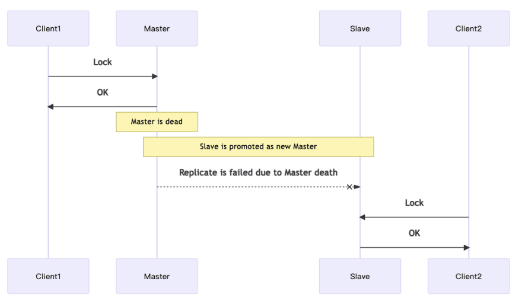
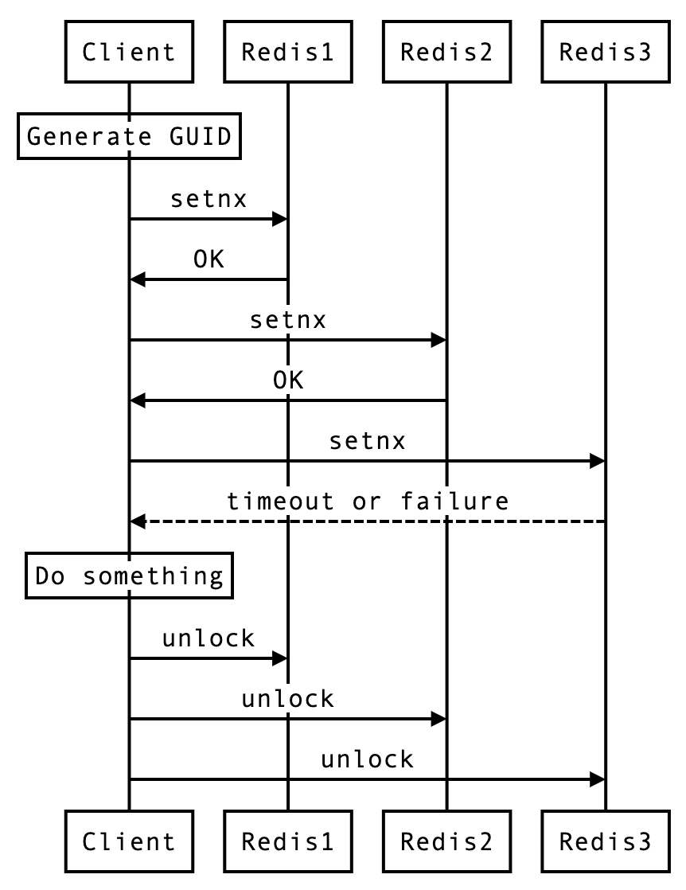

# ✅什么是RedLock，他解决了什么问题？

# 典型回答


**RedLock是Redis的作者提出的一个多节点分布式锁算法，旨在解决使用单节点Redis分布式锁可能存在的单点故障问题。**（[https://redis.io/docs/manual/patterns/distributed-locks/](https://redis.io/docs/manual/patterns/distributed-locks/) ）


Redis的单点故障问题：

1、在使用单节点Redis实现分布式锁时，如果这个Redis实例挂掉，那么所有使用这个实例的客户端都会出现无法获取锁的情况。

2、当使用集群模式部署的时候，如果master一个客户端在master节点加锁成功了，然后没来得及同步数据到其他节点上，他就挂了， 那么这时候如果选出一个新的节点，再有客户端来加锁的时候，就也能加锁成功，因为数据没来得及同步，新的master会认为这个key是不存在的。




如上图，就是我们前面说的第二个问题。


RedLock通过使用多个Redis节点，来提供一个更加健壮的分布式锁解决方案，能够在某些Redis节点故障的情况下，仍然能够保证分布式锁的可用性。


**RedLock是通过引入多个Redis节点来解决单点故障的问题。**


在进行加锁操作时，RedLock会向每个Redis节点发送相同的命令请求，每个节点都会去竞争锁，如果至少在大多数节点上成功获取了锁，那么就认为加锁成功。反之，如果大多数节点上没有成功获取锁，则加锁失败。这样就可以避免因为某个Redis节点故障导致加锁失败的情况发生。





在redis集群中有3个节点的情况下：


1、客户端想要获取锁时，会生成一个全局唯一的ID（官方文档建议使用系统时间来生成这个ID）

2、客户端尝试使用这个ID获取所有redis节点的同意，这一步通过使用SETNX命令实现。

3、如果有2个以上的节点同意，那么锁就被成功设置了。

4、获取锁之后，用户可以执行想要的操作。

5、最后，不想用这把锁的时候，再尝试依次解锁，无论锁是否成功获取。


这样，当超过半数以上的节点都写入成功之后，即使master挂了，新选出来的master也能保证刚刚的那个key一定存在（否则这个节点就不会被选为master）。


需要注意的是，RedLock并不能完全解决分布式锁的问题。例如，在脑裂的情况下，RedLock可能会产生两个客户端同时持有锁的情况。


# 扩展知识


## 如何使用


了解了RedLock的机制之后，我们在Java中如何使用呢？可以直接使用RedissonRedLock，他是支持RedLock算法的：


```plain
Config config1 = new Config();
config1.useSingleServer()
       .setAddress("redis://127.0.0.1:6379");

Config config2 = new Config();
config2.useSingleServer()
       .setAddress("redis://127.0.0.1:6380");

Config config3 = new Config();
config3.useSingleServer()
       .setAddress("redis://127.0.0.1:6381");

RedissonClient redissonClient1 = Redisson.create(config1);
RedissonClient redissonClient2 = Redisson.create(config2);
RedissonClient redissonClient3 = Redisson.create(config3);

RLock lock1 = redissonClient1.getLock("lockKey");
RLock lock2 = redissonClient2.getLock("lockKey");
RLock lock3 = redissonClient3.getLock("lockKey");

RedissonRedLock redLock = new RedissonRedLock(lock1, lock2, lock3);

boolean lockResult = redLock.tryLock(waitTime, leaseTime, TimeUnit.MILLISECONDS);

// 业务逻辑

if (lockResult) {
    try {
        // 业务逻辑
    } finally {
        redLock.unlock();
    }
} else {
    // 获取锁失败的处理逻辑
}

redissonClient1.shutdown();
redissonClient2.shutdown();
redissonClient3.shutdown();

```


除了Redisson，还有其他的一些工具可以用于实现RedLock，比如Java的**Redlock-java**库、Go的Redsync库等。这些工具的使用方式类似，都是创建多个Redis实例，然后使用RedLock算法获取分布式锁。


## 分歧


关于RedLock，两位大佬曾经展开过激烈的讨论，感兴趣可以了解一下。


[https://martin.kleppmann.com/2016/02/08/how-to-do-distributed-locking.html](https://martin.kleppmann.com/2016/02/08/how-to-do-distributed-locking.html)


[http://antirez.com/news/101](http://antirez.com/news/101)


Martin 是著名的分布式系统专家，在他的博客上发表了一篇文章([https://martin.kleppmann.com/2016/02/08/how-to-do-distributed-locking.html](https://martin.kleppmann.com/2016/02/08/how-to-do-distributed-locking.html) )。在这篇文章中，他认为使用 RedLock 实现分布式锁是有问题的。他的观点是**：RedLock 存在着很多潜在的问题，比如网络延迟、时钟漂移等问题。**他认为使用 Redis 的 SET NX EX 命令来实现分布式锁，他认为这种方案是更加简单、可靠、安全的。


1. 网络分区：在网络分区的情况下，不同的节点可能会获取到相同的锁，这会导致分布式系统的不一致性问题。
2. 时间漂移：由于不同的机器之间的时间可能存在微小的漂移，这会导致锁的失效时间不一致，也会导致分布式系统的不一致性问题。
3. Redis 的主从复制：在 Redis 主从复制的情况下，如果 Redis 的主节点出现故障，需要选举新的主节点。这个过程中可能会导致锁的丢失，同样会导致分布式系统的不一致性问题。


Antirez 是 Redis 的作者，，他在自己的博客上发表了一篇文章([http://antirez.com/news/101](http://antirez.com/news/101) )，对 Martin 的观点提出了不同看法。他认为，虽然 RedLock 算法可能存在一些问题，但是这种算法本质上是正确的，可以保证分布式锁的正确性。他认为使用 Redis 实现分布式锁也存在着很多问题，比如 Redis 服务器崩溃、网络分区等问题，而 RedLock 算法可以一定程度上解决这些问题。


1. 网络分区：在网络分区的情况下，RedLock 仍然可以提供足够的可靠性。虽然会存在节点获取到相同锁的情况，但这种情况只会发生在网络分区发生时，且只会发生在一小部分节点上。而在网络分区恢复后，RedLock 会自动解锁。
2. 时间漂移：RedLock 可以使用 NTP 等工具来同步不同机器之间的时间，从而避免时间漂移导致的问题。
3. Redis 的主从复制：虽然 Redis 的主从复制可能导致锁的丢失，但这种情况非常罕见，并且可以通过多种方式来避免，例如使用 Redis Cluster。


## 被废弃


[✅Redisson 中为什么要废弃 RedLock](https://www.yuque.com/hollis666/dr9x5m/fz545rxlub3czyg6)


> 更新: 2024-07-08 12:11:56  
> 原文: <https://www.yuque.com/hollis666/dr9x5m/lxzg0ubs2xpvenxw>