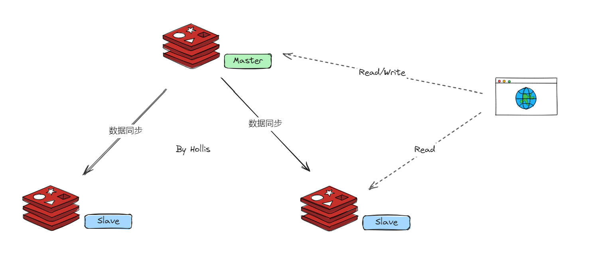
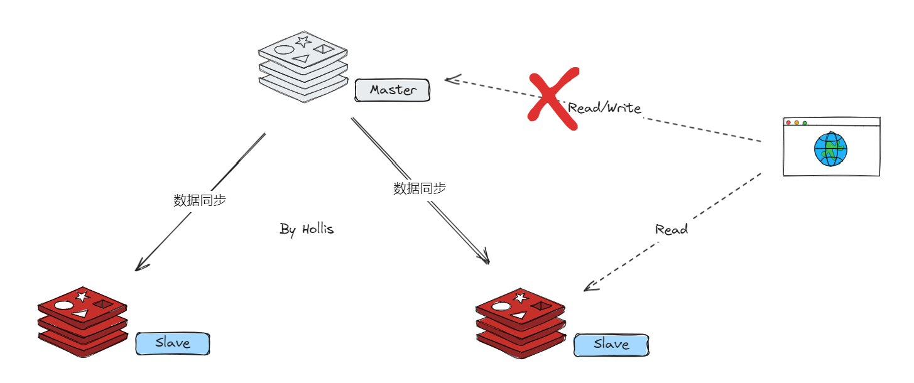
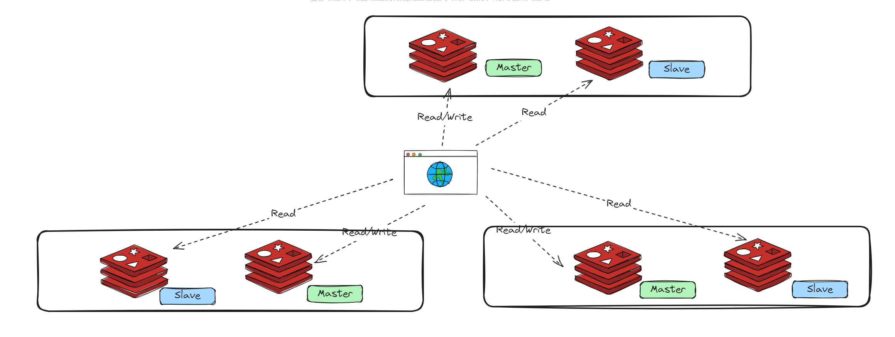

# ✅介绍一下Redis的集群模式？

Redis有三种主要的集群模式，用于在分布式环境中实现高可用性和数据复制。这些集群模式分别是：主从复制（Master-Slave Replication）、哨兵模式（Sentinel）和Redis Cluster模式。

### 主从模式

主从复制是Redis最简单的集群模式。这个模式主要是为了解决单点故障的问题，所以将数据复制多个副本中，这样即使有一台服务器出现故障，其他服务器依然可以继续提供服务。

主从模式中，包括一个主节点（Master）和一个或多个从节点（Slave）。**主节点负责处理所有写操作和读操作，而从节点则复制主节点的数据，并且只能处理读操作。**当主节点发生故障时，可以将一个从节点升级为主节点，实现故障转移（需要手动实现）。

**主从复制的优势在于简单易用，适用于读多写少的场景。**它提供了数据备份功能，并且可以有很好的扩展性，只要增加更多的从节点，就能让整个集群的读的能力不断提升。

但是主从模式最大的缺点，就是不具备故障自动转移的能力，没有办法做容错和恢复。

主节点和从节点的宕机都会导致客户端部分读写请求失败，需要人工介入让节点恢复或者手动切换一台从节点服务器变成主节点服务器才可以。并且在主节点宕机时，如果数据没有及时复制到从节点，也会导致数据不一致。

### 哨兵模式

为了解决主从模式的无法自动容错及恢复的问题，Redis引入了一种哨兵模式的集群架构。

哨兵模式是在主从复制的基础上加入了哨兵节点。哨兵节点是一种特殊的Redis节点，用于监控主节点和从节点的状态。当主节点发生故障时，哨兵节点可以自动进行故障转移，选择一个合适的从节点升级为主节点，并通知其他从节点和应用程序进行更新。

在原来的主从架构中，引入哨兵节点，其作用是监控Redis主节点和从节点的状态。通常需要部署多个哨兵节点，以确保故障转移的可靠性。

哨兵节点定期向所有主节点和从节点发送**PING**命令，如果在指定的时间内未收到**PONG**响应，哨兵节点会将该节点标记为主观下线。如果一个主节点被多数哨兵节点标记为**主观下线**，那么它将被标记为**客观下线**。

当主节点被标记为**客观下线**时，哨兵节点会触发故障转移过程。它会从所有健康的从节点中选举一个新的主节点，并将所有从节点切换到新的主节点，实现自动故障转移。同时，哨兵节点会更新所有客户端的配置，指向新的主节点。

哨兵节点通过发布订阅功能来通知客户端有关主节点状态变化的消息。客户端收到消息后，会更新配置，将新的主节点信息应用于连接池，从而使客户端可以继续与新的主节点进行交互。

这个哨兵模式的优点就是为整个集群提供了一种故障转移和恢复的能力。

### Cluster模式

Redis Cluster是Redis中推荐的分布式集群解决方案。它将数据**自动分片**到多个节点上，每个节点负责一部分数据。 

Redis Cluster采用主从复制模式来提高可用性。每个分片都有一个主节点和多个从节点。主节点负责处理写操作，而从节点负责复制主节点的数据并处理读请求。

Redis Cluster能够自动检测节点的故障。当一个主节点失去连接或不可达时，Redis Cluster会尝试将该节点标记为不可用，并从可用的从节点中提升一个新的主节点。

Redis Cluster是适用于大规模应用的解决方案，它提供了更好的横向扩展和容错能力。它自动管理数据分片和故障转移，减少了运维的负担。

Cluster模式的特点是数据分片存储在不同的节点上，每个节点都可以单独对外提供读写服务。不存在单点故障的问题。

关于分片的规则和细节，参考：

[✅什么是Redis的数据分片？](https://www.yuque.com/hollis666/dr9x5m/fm1elfrg5mn9iw65)

关于 Cluster 中存在对事务和 lua 的限制，参考：

[✅Redis Cluster 中使用事务和 lua 有什么限制？](https://www.yuque.com/hollis666/dr9x5m/zb66y7he56otikqs)

> 更新: 2025-02-09 12:35:48  
> 原文: <https://www.yuque.com/hollis666/dr9x5m/namhuv165lorwudw>