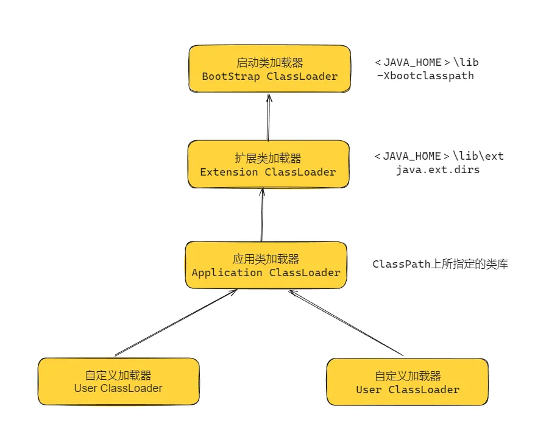
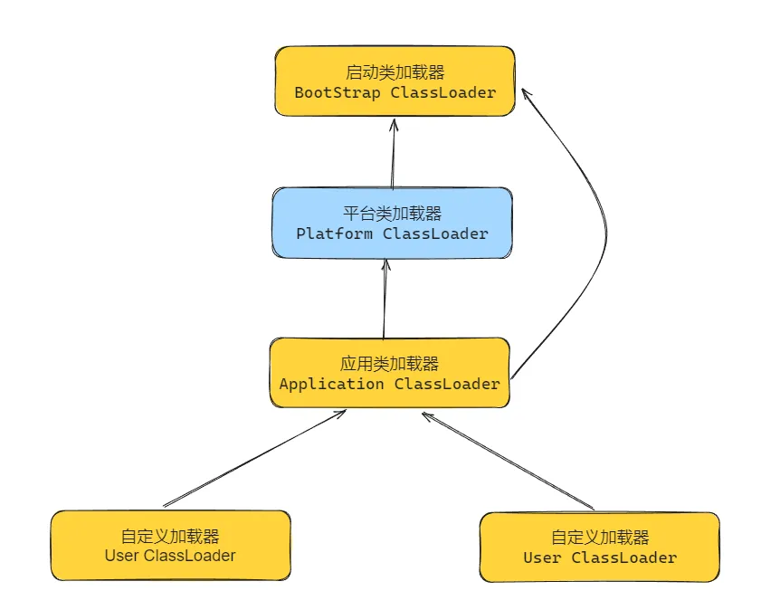

# ✅SpringBoot和传统的双亲委派有什么不一样吗？

# 典型回答


传统的采用双亲委派的类加载机制大家都知道，要加载一个类的额时候，先委托父类加载器加载该类；如果父类加载器无法找到（类不存在），才由当前 `ClassLoader` 加载；这样保证了核心类库（rt.jar）不会被重复加载，避免了类冲突问题。


在JDK 1.8之前，传统的双亲委派如下：


[✅什么是双亲委派？如何破坏？](https://www.yuque.com/hollis666/dr9x5m/gt8zp4)





在JDK 1.9中，传统的双亲委派如下：


[✅JDK1.8和1.9中类加载器有哪些不同](https://www.yuque.com/hollis666/dr9x5m/mla5wg5f3xwifa1d)





**Spring Boot 打破了传统的双亲委派模型，采用 自定义的 **`**LaunchedURLClassLoader**`** 进行类加载，主要为了支持 "Fat JAR"（可执行 JAR） 的运行。**

****

[✅什么是fat jar？](https://www.yuque.com/hollis666/dr9x5m/fxyiyg6l43egwe93)

**  **

在 Spring Boot 中，使用 Maven 或 Gradle 构建项目时，`lib/` 目录中的第三方依赖是以 JAR 形式打包进主 JAR 内部，默认会生成一个包含所有依赖项的 fat jar。


<font style="background-color:#FBDE28;">传统的 </font>`<font style="background-color:#FBDE28;">Application ClassLoader</font>`<font style="background-color:#FBDE28;"> 只能从 </font>**<font style="background-color:#FBDE28;">外部 </font>**`**<font style="background-color:#FBDE28;">classpath</font>**`<font style="background-color:#FBDE28;"> 加载类，无法直接加载 </font>**<font style="background-color:#FBDE28;">JAR 包内嵌的其他 JAR（fat jar）</font>**<font style="background-color:#FBDE28;">。 因此 Spring Boot 需要自定义类加载器。</font>


为了支持 **Fat JAR 运行模式**，Spring Boot **使用 **`**LaunchedURLClassLoader**`** 替代 **`**AppClassLoader**`，打破双亲委派机制，核心做法是：

+ **先加载 **`**BOOT-INF/classes**`** 目录下的应用类**（优先于 JDK 类）。
+ **再加载 **`**BOOT-INF/lib/**`** 目录下的依赖 JAR**（传统 `AppClassLoader` 无法加载嵌套 JAR）。
+ **最后才交给父类加载器**（即 JDK 提供的 `AppClassLoader`）。

****

**<font style="background-color:#FBDE28;">也就是说Spring Boot 先尝试加载自身的类和依赖 JAR，找不到才交给父类加载器，从而打破双亲委派。</font>**

**<font style="background-color:#FBDE28;"></font>**

**<font style="background-color:#FBDE28;"></font>**

**<font style="background-color:#FBDE28;"></font>**

Talk is Cheap，Show me the Code：


[https://github.com/joansmith/spring-boot/blob/master/spring-boot-tools/spring-boot-loader/src/main/java/org/springframework/boot/loader/LaunchedURLClassLoader.java](https://github.com/joansmith/spring-boot/blob/master/spring-boot-tools/spring-boot-loader/src/main/java/org/springframework/boot/loader/LaunchedURLClassLoader.java)


以下是LaunchedURLClassLoader 的源码：


```plain
@Override
	protected Class<?> loadClass(String name, boolean resolve)
			throws ClassNotFoundException {
		synchronized (LaunchedURLClassLoader.LOCK_PROVIDER.getLock(this, name)) {
			Class<?> loadedClass = findLoadedClass(name);
			if (loadedClass == null) {
				Handler.setUseFastConnectionExceptions(true);
				try {
					loadedClass = doLoadClass(name);
				}
				finally {
					Handler.setUseFastConnectionExceptions(false);
				}
			}
			if (resolve) {
				resolveClass(loadedClass);
			}
			return loadedClass;
		}
	}

	private Class<?> doLoadClass(String name) throws ClassNotFoundException {

		// 1) Try the root class loader
		try {
			if (this.rootClassLoader != null) {
				return this.rootClassLoader.loadClass(name);
			}
		}
		catch (Exception ex) {
			// Ignore and continue
		}

		// 2) Try to find locally
		try {
			findPackage(name);
			Class<?> cls = findClass(name);
			return cls;
		}
		catch (Exception ex) {
			// Ignore and continue
		}

		// 3) Use standard loading
		return super.loadClass(name, false);
	}
```


**可以看到，在loadClass方法中，主要调用doLoadClass，仔细看doLoadClass的第37行，和第45行，可以看到，先执行37行的findClass，然后再执行45行的super.loadClass，这就意味着，他会先自己加载，然后加载不到再委托给父加载器加载的。**


> 更新: 2025-03-15 15:34:38  
> 原文: <https://www.yuque.com/hollis666/dr9x5m/uh3gfne727y8ddhw>