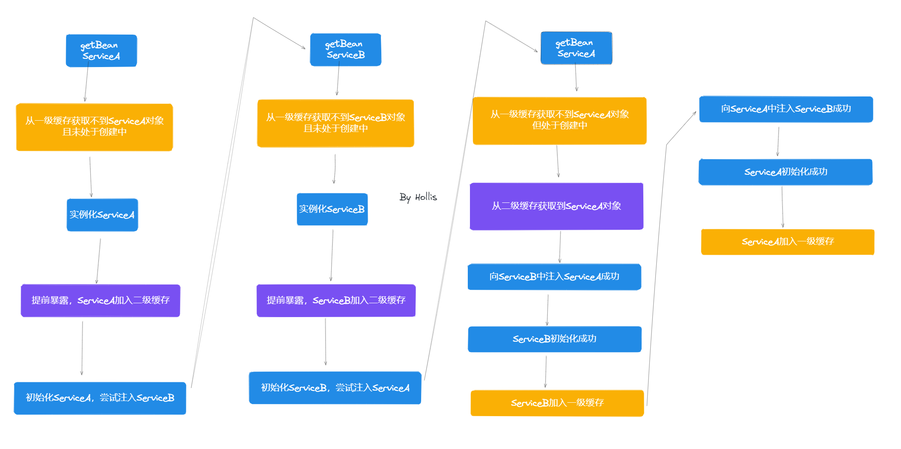

# ✅Spring解决循环依赖一定需要三级缓存吗？

# 典型回答


其实，使用二级缓存也能解决循环依赖的问题，但是如果完全依靠二级缓存解决循环依赖，意味着当我们依赖了一个代理类的时候，就需要在Bean实例化之后完成AOP代理。而在Spring的设计中，为了解耦Bean的初始化和代理，是通过AnnotationAwareAspectJAutoProxyCreator这个后置处理器来在Bean生命周期的最后一步来完成AOP代理的。


但是，在Spring的初始化过程中，他是不知道哪些Bean可能有循环依赖的，那么，这时候Spring面临两个选择：


1. 不管有没有循环依赖，都提前把代理对象创建出来，并将代理对象缓存起来，出现循环依赖时，其他对象直接就可以取到代理对象并注入。
2. 不提前创建代理对象，在出现循环依赖时，再生成代理对象。这样在没有循环依赖的情况下，Bean就可以按着Spring设计原则的步骤来创建。


第一个方案看上去比较简单，只需要二级缓存就可以了。但是他也意味着，Spring需要在所有的bean的创建过程中就要先生成代理对象再初始化；那么这就和spring的aop的设计原则（前文提到的：在Spring的设计中，为了解耦Bean的初始化和代理，是通过AnnotationAwareAspectJAutoProxyCreator这个后置处理器来在Bean生命周期的最后一步来完成AOP代理的）是相悖的。


而Spring为了不破坏AOP的代理设计原则，则引入第三级缓存，在三级缓存中保存对象工厂，因为通过对象工厂我们可以在想要创建对象的时候直接获取对象。有了它，在后续发生循环依赖时，如果依赖的Bean被AOP代理，那么通过这个工厂获取到的就是代理后的对象，如果没有被AOP代理，那么这个工厂获取到的就是实例化的真实对象。


# 扩展知识


其实，只用二级缓存，也是可以解决循环依赖的问题的，如下图，没有三级缓存，只有二级缓存的话，也是可以解决循环依赖的。





那么，为什么还需要引入三级缓存呢？我们看下两个过程的区别主要是什么呢？


我给大家标出来了，如果使用三级缓存，在实例化之后，初始化之前，向三级缓存中保存的是ObjectFactory。而如果使用二级缓存，那么在这个步骤中保存的就是具体的Object。


这里如果我们只用二级缓存，对于普通对象的循环依赖问题是都可以正常解决的，但是如果是代理对象的话就麻烦多了，并且AOP又是Spring中很重要的一个特性，代理又不能忽略。


我们都知道，我们是可以在一个ServiceA中注入另外一个ServiceB的代理对象的，那么在解决循环依赖过程中，如果需要注入ServiceB的代理对象，就需要把ServiceB的代理对象创建出来，但是这时候还只是ServiceB的实例化阶段，代理对象的创建要等到初始化之后，在后置处理的postProcessAfterInitialization方法中对初始化后的Bean完成AOP代理的。


那怎么办好呢？Spring想到了一个好的办法，那就是使用三级缓存，并且在这个三级缓存中，并没有存入一个实例化的对象，而是存入了一个匿名类<font style="color:rgb(51, 51, 51);">ObjectFactory（其实本质是一个</font>函数式接口`() -> getEarlyBeanReference(beanName, mbd, bean)`），具体代码如下：


```plain
public abstract class AbstractAutowireCapableBeanFactory extends AbstractBeanFactory
		implements AutowireCapableBeanFactory {
  protected Object doCreateBean(String beanName, RootBeanDefinition mbd, @Nullable Object[] args)
    throws BeanCreationException {
    ....
    
    // 如果允许循环引用，且beanName对应的单例bean正在创建中，则早期暴露该单例bean，以便解决潜在的循环引用问题
    	boolean earlySingletonExposure = (mbd.isSingleton() && this.allowCircularReferences &&
    			isSingletonCurrentlyInCreation(beanName));
    	if (earlySingletonExposure) {
    		if (logger.isTraceEnabled()) {
    			logger.trace("Eagerly caching bean '" + beanName +
    					"' to allow for resolving potential circular references");
    		}
    		// 向singletonFactories添加该beanName及其对应的提前引用对象，以便解决潜在的循环引用问题
    		addSingletonFactory(beanName, () -> getEarlyBeanReference(beanName, mbd, bean));
    	}
    
    ...
    }
}

```


> 更新: 2025-01-04 18:40:26  
> 原文: <https://www.yuque.com/hollis666/dr9x5m/edvhrik3pbw300os>