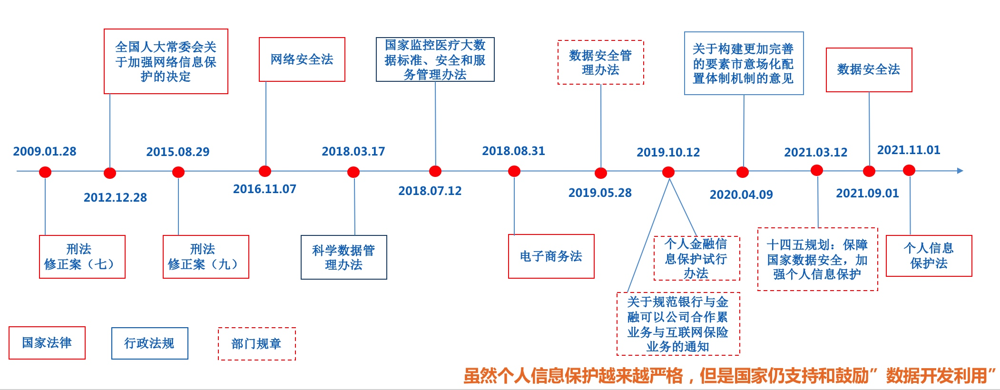
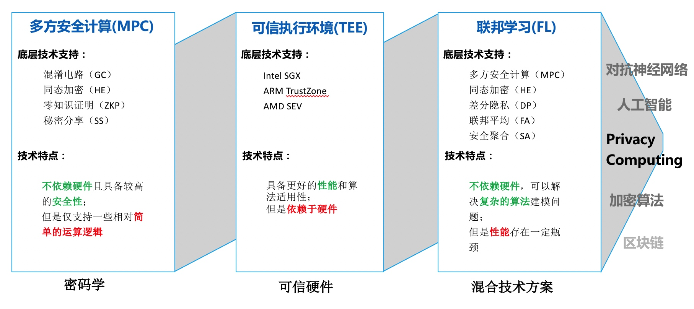
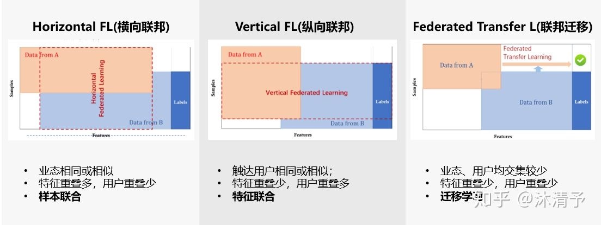
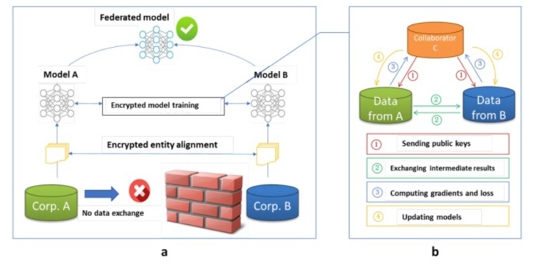

# 什么是隐私计算？

最近一段时间，我除了写业务代码之外，还整了个新鲜玩意，那就是参与搞了一下隐私计算相关的事情。

现在有空了，刚好总结一下。因为隐私计算可能对于很多工程开发朋友来说很陌生，所以，**我这篇文章主要是给大家科普一下，让大家知道有这么个技术以及现在的主要方向。**这里面不会有太多的算法内容和底层原理，相信大家应该都能看得懂。

随着移动互联网、云计算、物联网等信息技术的蓬勃发展，世界进入了数据爆炸的"大数据时代"。在各行各业，数据都发挥着至关重要的作用，越来越多的场景需要多方数据的流通和共享。如我们所在的金融部门，则需要借助外部金融数据，结合我们的场景业务数据进行联合建模，实现联合风控、数字营销、智能反诈、精准获客等。

所以，站在这个历史节点上，在数据合作、共享方面，横亘在我们面前的有几个重要的问题需要解决：

1、“数据孤岛“现象普遍存在；数据流通安全性风险高；  
2、数据合规监管日趋严格；隐私泄露导致信任鸿沟；

其中，随着个人信息保护法在2021年11月的推出，监管问题更是我们亟待解决的。

但是近几年，随着电子商务法、数据安全法、《个人信息保护法》等一系列法律法规的推出，使得我们不得不重视个人隐私的问题。

虽然个人信息的保护越来越严格，但是，从很多的法规中我们可以解读出来，其实，大的形式上，官方还是比较支持我们合规的进行数据的利用和开发的。

那么，如何解决这些问题呢？

其实，从《个保法》中我们可以找到一些切入口，根据中对个人信息的定义是这样的：

以电子或者其他方式记录的**与已识别或者可识别的自然人有关的**各种信息，**不包括匿名化处理后的信息。**

可见，如果我们能够对个人信息进行**去标识化**和**匿名化**处理，那么，就可以利用这些信息了。

所以，很多相关的技术也就诞生了，这些技术主要解决的就是通过数据**可用不可见**的方式帮助我们进行跨机构间的数据协同。这类技术，统称为隐私计算技术。

隐私保护计算经过很多年的发展，在具体的落地实现的技术上，主要有三个主流的方向：

1、基于密码学的多方安全计算（MPC）  
2、基于可信硬件的可信执行环境（TEE）  
3、基于混合技术方案的联邦学习（FL）

想要实现去标识化和匿名化，主要的方式就是让原始的用户数据无法被识别。

其中多方安全计算主要是基于密码学的方式，把数据进行加密处理，这样我们就可以使用加密后的数据进行算法建模了。

另外，可信执行环境是一种基于硬件的数据，大概就是把数据放到一个硬件中，只在这个硬件内部使用，外部无法直接读取。

还有一种技术那就是混合了多种方案的技术，那就是联邦学习。

其中联邦学习因为其不依赖硬件、可以解决复杂的算法建模问题等优势，虽然相比其他方案存在着一定的效率问题，但是随着技术的发展，如何突破性能瓶颈，达到实用性、安全性的平衡，并进一步提升安全性，这些问题终将被解决。所以，这项技术被认为是"人工智能的最后一公里"、"下一代人工智能协同算法和协作网络的基础"。

### 联邦学习

**联邦学习（Federated Learning）**是一种新兴的人工智能基础技术，在 2016 年由谷歌最先提出，原本用于解决安卓手机终端用户在本地更新模型的问题，其**设计目标是在保障大数据交换时的信息安全、保护终端数据和个人数据隐私、保证合法合规的前提下，在多参与方或多计算结点之间开展高效率的机器学习。**

我们把每个参与共同建模的企业称为参与方，根据多参与方之间数据分布的不同，把联邦学习分为三类：横向联邦学习、纵向联邦学习和联邦迁移学习。

横向联邦学习的本质是样本的联合，适用于参与者间业态相同但触达客户不同，即特征重叠多，用户重叠少时的场景，比如不同地区的银行间，他们的业务相似（特征相似），但用户不同（样本不同）。主要解决样本不足的问题。

纵向联邦学习的本质是特征的联合，适用于用户重叠多，特征重叠少的场景，比如同一地区的商超和银行，他们触达的用户都为该地区的居民（样本相同），但业务不同（特征不同）。主要解决特征不足的问题。

因为我们这面主要是金融业务，隐私计算的应用场景是基于联邦学习和外部银行、机构等做联合风控，多头借贷等金融业务。所以我们基本上是想用我们具有的用户的电商数据、和外部机构具有的信贷数据、征信数据等进行纵向连邦学习。

纵向联邦学习的主要流程如下：

第一步：加密样本对齐。是在系统级做这件事，因此在企业感知层面不会暴露非交叉用户。  
第二步：对齐样本进行模型加密训练：  
step1：由第三方C向A和B发送公钥，用来加密需要传输的数据；  
step2：A和B分别计算和自己相关的特征中间结果，并加密交互，用来求得各自梯度和损失；  
step3：A和B分别计算各自加密后的梯度并添加掩码发送给C，同时B计算加密后的损失发送给C；  
step4：C解密梯度和损失后回传给A和B，A、B去除掩码并更新模型。

### FATE 框架

因为目前关于联邦学习的技术，很多大厂都有在投入，其中阿里、蚂蚁、字节、腾讯等都很多成功的案例。

我们此次在进行联邦学习相关调研的时候，有不同的同事分别调研不同的框架。我这面主要负责基于开源的框架进行调研。

因为关于联邦学习，最重要的还是解决数据的安全性问题，目前看来，很多外部机构，对于开源的框架接受度更高一些。市面上也有很多联邦学习框架，如微众银行开源的FATE、字节开源的FedLearner、百度开源的PaddleFL等。其中 FATE 被使用的最广泛，被认为是联邦学习的样板项目。

FATE (Federated AI Technology Enabler) 是微众银行AI部门发起的开源项目，为联邦学习生态系统提供了可靠的安全计算框架。FATE项目使用多方安全计算 (MPC) 以及同态加密 (HE) 技术构建底层安全计算协议，以此支持不同种类的机器学习的安全计算，包括逻辑回归、基于树的算法、深度学习和迁移学习等。

FATE 有4种部署方式，分别是基于Docker-Compose的部署、Standalone部署、Native的集群部署、基于KubeFATE的部署。

+  基于Docker-Compose：快速体验一下FATE，跑的模型和数据在单台机器就够了，部署起来比较简单。 
+  Standalone单机部署：只是想开发算法，而开发机器性能又不高。 
+  基于KubeFATE：对FATE的使用需求因数据集和模型变大，需要扩容，并且里面有数据需要维护一个FATE集群，则考虑使用基于KubeFATE在Kubernetes集群的部署方案。 
+  Native的集群部署：一般是在特殊原因下才会用，如内部无法部署Kubernetes，或者需要对FATE的部署进行自己的二次开发等。  
为了快速验证，我们此次部署主要是采用了基于Docker-Compose和基于KubeFATE两种部署方式。部署过程中还是遇到了很多的问题的。 

关于这两种部署方式的部署过程以及一些问题的解决，不是本文的重点，我把他们单独放到我的博客中了，大家如果感兴趣可以去我的博客中阅读。

下面这张就是 FATE 的一个部署架构图：

太多的细节就不在这里深入介绍了。

我们基于 FATE，和外部机构合作搞了一套联邦学习的环境，阿里作为一方、外部机构作为另外一方，对大概十几万的数据做了联邦学习的建模。

最终结果还是比较符合我们的预期的，联邦学习的建模方式和本地建模，在性能上的损耗很小，小到几乎可忽略。

### 其他

以上，算是我对这段时间关于隐私计算&联邦学习的一些调研以及实践的一些总结。

之所以要研究这个，一方面是工作中需要，另外一方面，对于新技术，我们还是要多多接触了解一下。尤其是这些对于当下以及未来都是很重要的东西。

> 更新: 2024-12-21 13:07:02  
> 原文: <https://www.yuque.com/hollis666/dr9x5m/ofkapxgnuac0nh1h>