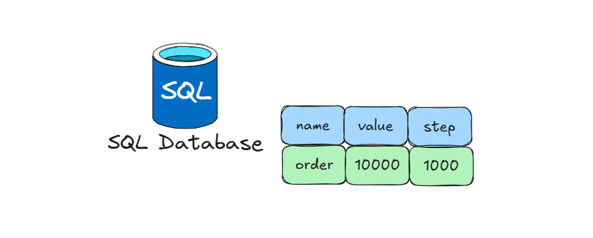
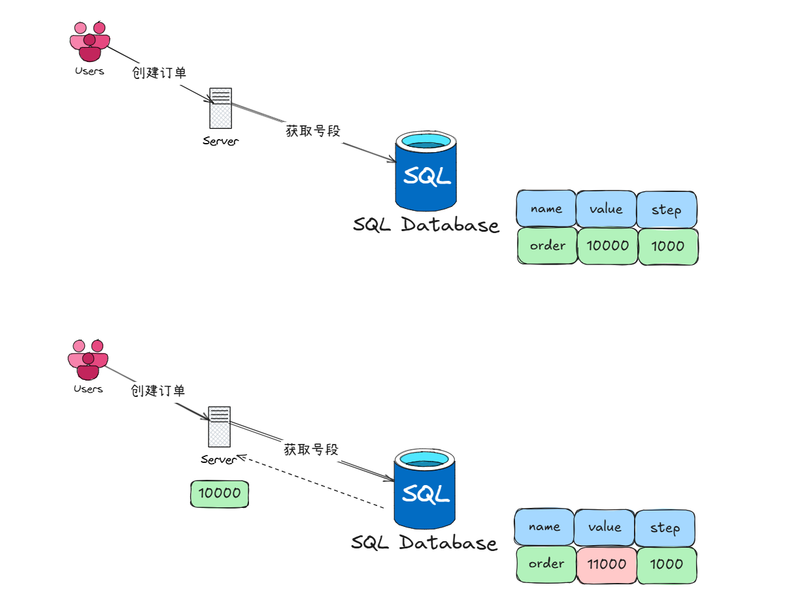
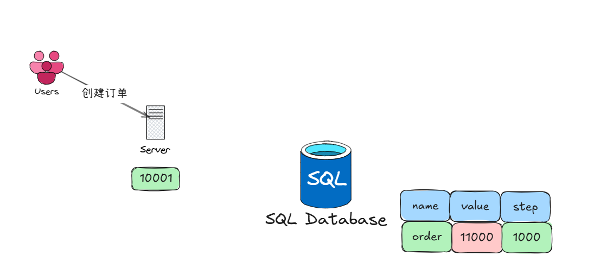

# ✅详细介绍下号段模式生成分布式ID的原理和优缺点？

# 典型回答

号段模式是一种常见的分布式ID生成方案，主要用于生成全局唯一的ID。其核心思想是通过分配一定范围（段）的ID，避免了频繁访问数据库，提高了性能。

+ 号段模式通常通过一个中心服务（比如数据库）来生成ID段（一个区间）。该中心服务负责生成多个ID段，每个ID段具有固定的步长（如1000个、10000个等）。

+ 然后，系统中的各个节点（如微服务、应用服务器等）从该中心服务申请一个号段。

+ 一旦某个节点获取了一个号段，它就可以在这个号段内生成多个ID，而不需要再次与中心服务交互。

+ 号段的范围是预先确定好的，例如：节点A获取到的号段是 [1001, 2000]，节点B获取到的号段是 [2001, 3000]，每个节点内部的ID是按顺序递增的。

举个具体的例子，假如我的订单表做了分库分表，然后我需要生成一个全局的唯一id，那么我就在一张单表中创建一张表吗sequence表，表中字段如下：

| id | 主键id |
| --- | --- |
| gmt_create | 创建时间 |
| gmt_modified | 修改时间 |
| name | 表名 |
| value | 值 |
| step | 步长 |

假设value的初始值是10000，然后每一次获取号段的步长是1000

这样当第一个台机器想要生成一个订单的时候，他会到sequece表中查询sequence，然后把它的值更新成sequence+1000。然后这台机器会把10000保存在自己的本地缓存中，然后这一次就可以用10000作为订单的主键id了，然后再本地缓存中更新一下10000已经被使用了。

下次再有订单来创建的时候，因为他本地已经缓存了一个号段，那么他就直接用，把10001拿出来用就行了。

这时候如果有另外一台机器也要生成id，他本地缓存还没有值，他就也去sequence表，查询到11000过来了，并且把表中的sequence更新成了12000，这时候他就可以用11000到11999这个号段的id了，在这范围内的订单都不需要再查询数据库了。直接用就行了。

通过这样的方式，既能实现每一次生成的id都不一样，也能减少和数据库的交互次数，提升分布式id的生成效率。同时也能避免完全依靠数据库做自增id带来的数据库单点瓶颈的问题。

但是这个方案还是有缺点的，比如虽然ID在单个节点内部是递增的，但不同节点之间的ID是离散的。比如节点A的ID是1001-2000，节点B的ID是2001-3000，这意味着它们之间的ID并不是连续的。有可能第一秒生成的id是1003，第二秒的是2002，第三秒的是1004。

#### 

> 更新: 2025-02-09 12:42:39  
> 原文: <https://www.yuque.com/hollis666/dr9x5m/xa0g0rchewxdt64y>