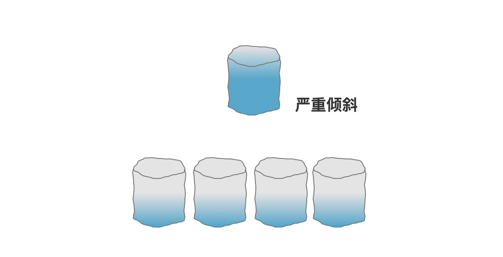
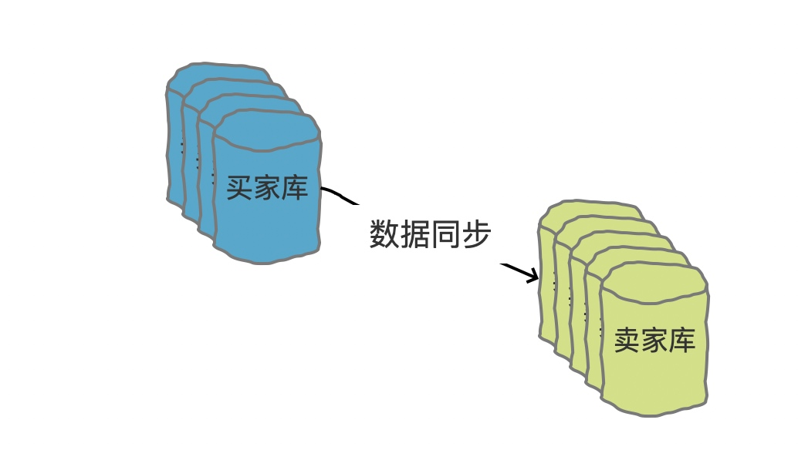
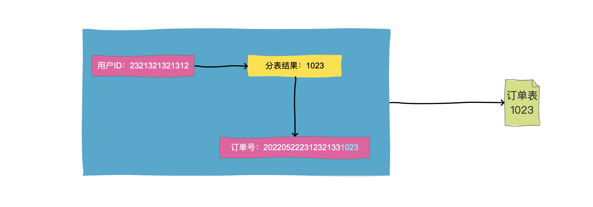

# ✅分表字段如何选择？

在分库分表的过程中，我们需要有一个字段用来进行分表，比如按照用户分表、按照时间分表、按照地区分表。这里面的用户、时间、地区就是所谓的分表字段。

那么，**在选择这个分表字段的时候，一定要注意，要根据实际的业务情况来做慎重的选择。**

比如说我们要对交易订单进行分表的时候，我们可以选择的信息有很多，比如买家Id、卖家Id、订单号、时间、地区等等，具体应该如何选择呢？

通常，如果有特殊的诉求，比如按照月度汇总、地区汇总等以外，我们通常建议大家按照买家Id进行分表。因为这样可以避免一个关键的问题那就是——数据倾斜（热点数据）。

[✅什么是数据倾斜，会带来哪些问题？如何解决？](https://www.yuque.com/hollis666/dr9x5m/fue0vmwupk5zps37)

### 买家还是卖家

首先，我们先说为什么不按照卖家分表？

因为我们知道，电商网站上面是有很多买家和卖家的，但是，一个大的卖家可能会产生很多订单，比如像苏宁易购、当当等这种店铺，他每天在天猫产生的订单量就非常的大。如果按照卖家Id分表的话，那同一个卖家的很多订单都会分到同一张表。

那就会使得有一些表的数据量非常的大，但是有些表的数据量又很小，这就是发生了**数据倾斜**。这个卖家的数据就变成了热点数据，随着时间的增长，就会使得这个卖家的所有操作都变得异常缓慢。

但是，买家ID做分表字段就不会出现这类问题，因为不太容易出现一个买家能把数据买倾斜了。

但是需要注意的是，**我们说按照买家Id做分表，保证的是同一个买家的所有订单都在同一张表 ，并不是要给每个买家都单独分配一张表。**

我们在做分表路由的时候，是可以设定一定的规则的，比如我们想要分1024张表，那么我们可以用买家ID或者买家ID的hashcode对1024取模，结果是0000-1023，那么就存储到对应的编号的分表中就行了。

### 卖家查询怎么办

如果按照买家Id进行了分表，那卖家的查询怎么办，这不就意味着要跨表查询了吗？

首先，业务问题我们要建立在业务背景下讨论。电商网站订单查询有几种场景？

1、买家查自己的订单

2、卖家查自己的订单

3、平台的小二查用户的订单。

首先，我们用买家ID做了分表，那么买家来查询的时候，是一定可以把买家ID带过来的，我们直接去对应的表里面查询就行了。

那如果是卖家查呢？卖家查询的话，同样可以带卖家id过来，那么，我们可以有一个基于binlog、flink等准实时的同步一张卖家维度的分表，这张表只用来查询，来解决卖家查询的问题。

本质上就是用空间换时间的做法。

不知道大家看到这里会不会有这样的疑问：同步一张卖家表，这不又带来了大卖家的热点问题了吗？

首先，我们说同步一张卖家维度的表来，但是其实所有的写操作还是要写到买家表的，只不过需要准实时同步的方案同步到卖家表中。也就是说，我们的这个卖家表理论上是没有业务的写操作，只有读操作的。

所以，这个卖家库只需要有高性能的读就行了，那这样的话就可以有很多选择了，比如可以部署到一些配置不用那么高的机器、或者其实可以干脆就不用MYSQL，而是采用HBASE、PolarDB、Lindorm等数据库就可以了。这些数据库都是可以海量数据，并提供高性能查询的。

还有呢就是，大卖家一般都是可以识别的，提前针对大卖家，把他的订单，再按照一定的规则拆分到多张表中。因为只有读，没有写操作，所以拆分多张表也不用考虑事务的问题。

> 这里说的没有写指的是不会主动操作这张卖家表做更新，他的数据都是从买家表同步过来的，这个同步的事务在买家表已经处理过了，卖家表只需要负责同步。
>
> 
>
> 卖家更新数据也一样，都是基于订单号更新的，订单号上面是带来分表信息的，直接到买家表去更新，然后同步到卖家表。
>

### 订单查询怎么办

上面说的都是有买卖家ID的情况，那没有买卖家ID呢？用订单号直接查怎么办呢？

这种问题的解决方案是，在生成订单号的时候，我们一般会把分表结果编码到订单号中去，因为订单生成的时候是一定可以知道买家ID的，那么我们就把买家ID的路由结果比如1023，作为一段固定的值放到订单号中就行了。这就是所谓的**"基因法"**

这样按照订单号查询的时候，解析出这段数字，直接去对应分表查询就好了。

至于还有人问其他的查询，没有买卖家ID，也没订单号的，那其实就属于是低频查询或者非核心功能查询了，那就可以用ES等搜索引擎的方案来解决了。就不赘述了。

> 更新: 2024-08-03 10:56:11  
> 原文: <https://www.yuque.com/hollis666/dr9x5m/mec4ust5rpfob78r>