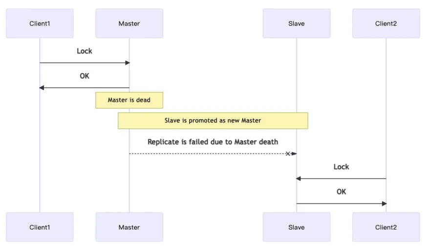

# ✅A线程获取Redis分布式锁，但那一刻做了主从的切换，B线程能获取到锁吗？

# 典型回答

这个问题，其实本质上想问的就是Redis分布式锁的单点问题。

问题是这样的：

当使用集群模式部署的时候，如果master一个客户端在master节点加锁成功了，然后没来得及同步数据到其他节点上，他就挂了， 那么这时候如果选出一个新的节点，再有客户端来加锁的时候，就也能加锁成功，因为数据没来得及同步，新的master会认为这个key是不存在的。

所以，基于以上的情况来说，**A线程获取Redis分布式锁，但那一刻做了主从的切换，B线程能不能获取到锁有以下几种情况：**

****

**<u>1、如果已完成主从同步，那么B线程无法加锁成功。</u>**

**<u>2、如果未来得及做主从同步，那么B线程可以加锁成功。</u>**

****

# 扩展知识
### 如何避免单点问题的发生？

[✅什么是RedLock，他解决了什么问题？](https://www.yuque.com/hollis666/dr9x5m/lxzg0ubs2xpvenxw)

## RedLock被废弃
[✅Redisson 中为什么要废弃 RedLock，该用啥？](https://www.yuque.com/hollis666/dr9x5m/fz545rxlub3czyg6)

> 更新: 2025-05-11 13:05:40  
> 原文: <https://www.yuque.com/hollis666/dr9x5m/hes38wzm9goflkki>