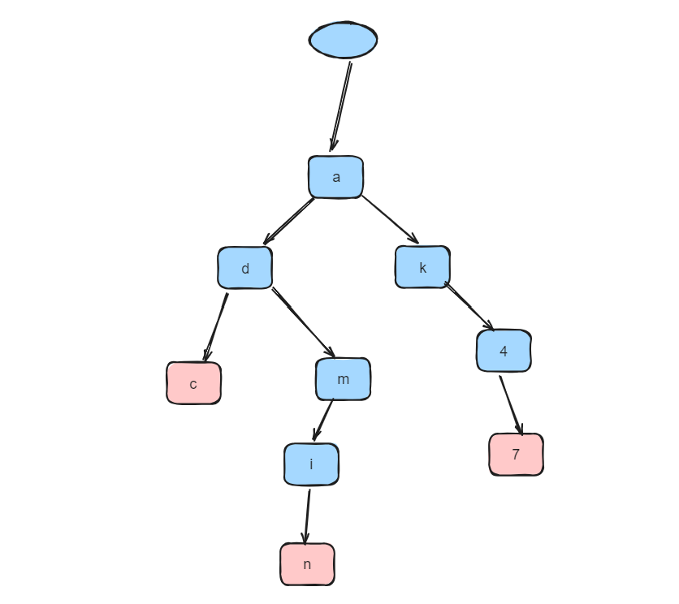
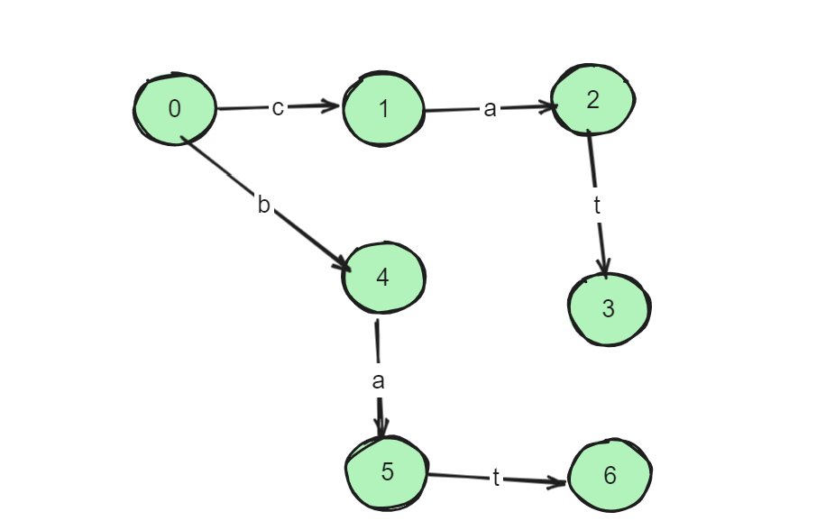
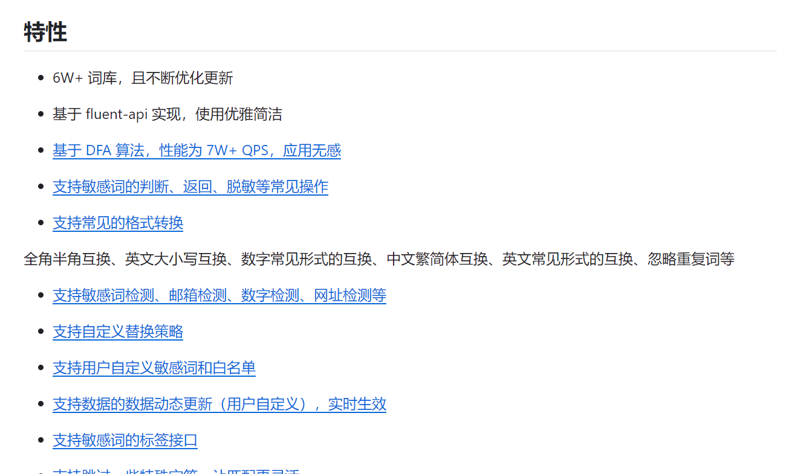

# ✅如何实现敏感词过滤？

# 典型回答


敏感词过滤是非常常见的一种手段，避免出现一些违规词汇。在实现上，有很多种方案。


### 字符串匹配


字符串匹配是最简单、直观的方法，直接在文本中查找是否存在敏感词列表中的词汇。如在Java中使用contains方法或者正则表达式都可以判断。


但是**他只适合小规模文本或敏感词较少的场合下使用**，比如我们在避免SQL注入的时候，需要对用户输入的内容进行一些特殊字符的过滤，就可以用这种方式，又或者是我们在做数据脱敏的时候，也可以用这种方式实现。


他的优点就是，**实现简单，易于理解**。但是缺点也很明显，就是**效率比较低**，特别是在处理大量文本或敏感词库较大时。还有就是无法处理变体词汇，如错别字、同音字等。


因为字符串匹配的基本原理是遍历待检测的文本，对于每一个可能的起始位置，检查是否有敏感词与之匹配。如以下是String中contains方法的主要实现：

```java
public boolean contains(CharSequence s) {
    return indexOf(s.toString()) > -1;
}

public int indexOf(int ch, int fromIndex) {
    final int max = value.length;
    if (fromIndex < 0) {
        fromIndex = 0;
    } else if (fromIndex >= max) {
        // Note: fromIndex might be near -1>>>1.
        return -1;
    }

    if (ch < Character.MIN_SUPPLEMENTARY_CODE_POINT) {
        // handle most cases here (ch is a BMP code point or a
        // negative value (invalid code point))
        final char[] value = this.value;
        for (int i = fromIndex; i < max; i++) {
            if (value[i] == ch) {
                return i;
            }
        }
        return -1;
    } else {
        return indexOfSupplementary(ch, fromIndex);
    }
}

```


可以看到它是通过一个for循环从头开始进行便利的。


对于长度为N的文本和M个敏感词，如果简单地使用遍历的方式进行字符串匹配，其时间复杂度接近于O(N×M)，在敏感词数量或文本长度大时，这将导致显著的性能瓶颈。


### 前缀树


前缀树，也被称为Trie树，是一种用于快速检索字符串数据集中的键的树形数据结构。


这种数据结构特别适合解决与一组字符串有关的问题，如自动补全、拼写检查、词频统计、敏感词过滤等。前缀树的核心优势在于，它能够通过共享前缀来最大化地减少查询和存储空间，特别是当处理大量具有共同前缀的字符串时。


[✅什么是前缀树，有什么作用？](https://www.yuque.com/hollis666/dr9x5m/waqku6qab64aow90)


前缀树比较适合敏感词有共同前缀的场景，如具有相同根词的不同变形。并且他比字符串更加适合大量敏感词和长文本的处理。


前缀树用于敏感词过滤的实现主要有以下步骤：


1、构建前缀树：


将所有敏感词逐个添加到前缀树中。


> 具体操作是：对于每个敏感词，从根节点开始，按照敏感词的字符顺序，逐个检查当前字符是否已经作为子节点存在。如果不存在，就创建一个新的节点，将当前字符存入节点，并将节点加入当前遍历节点的子节点集合中；如果存在，就继续沿着该子节点向下遍历。直到敏感词的所有字符都被添加到树中，标记最后一个字符对应的节点为一个敏感词的结束。
>


假设我们有敏感词列表["adc", "ak47", "admin"]，我们首先根据这个列表构建前缀树：

+ 根节点不包含字符，它的子节点为a。
+ a节点的子节点为d、k。d节点的子节点为c和m，k节点的子节点为4
+ 如此构建下去的前缀树如下：
+ 




2、敏感词过滤：


当需要检测一段文本是否包含敏感词时，可以将文本的每个字符作为起点，尝试在前缀树中进行匹配。


> 具体操作是：从文本的当前字符开始，尝试与前缀树的根节点的子节点进行匹配；如果匹配成功，则继续匹配下一个字符和当前节点的子节点；如果匹配不成功，则从文本的下一个字符重新开始匹配；如果匹配过程中到达了标记为敏感词结束的节点，则说明文本中包含敏感词。根据需要，可以直接标记敏感词位置，或者替换敏感词。
>


如果我们需要过滤一段文本：“this admin has an ak47”，我们从第一个字符t开始，在前缀树中进行匹配。直到我们到达a时，开始匹配到admin，这时我们发现admin是一个敏感词，可以进行相应的标记或替换操作。同样的过程适用于ak47。


前缀树的优点是，插入和查询效率高，特别是在敏感词有共同前缀的情况下（如ab、abc、abcd）。而且他的空间效率较高，因为是共享公共前缀的。

<font style="color:rgb(13, 13, 13);"></font>

但是他也有缺点，一方面是构建树的初期成本较高。另外对于没有共同前缀的敏感词，效率提升不明显。


所以，**前缀树适合做高效的字典查找、根据前缀自动补全、利用前缀匹配进行快速路由等场景。**


### DFA算法


DFA是Deterministic Finite Automaton的缩写，翻译过来叫确定有限自动机，DFA算法是一种高效的文本匹配算法，特别适合于敏感词过滤。


DFA由一组状态组成，以及在这些状态之间的转换，这些转换由输入字符串驱动。每个状态都知道下一个字符的到来应该转移到哪个状态。如果输入字符串结束时，DFA处于接受状态，则输入字符串被认为是匹配的。


前缀树用于敏感词过滤的实现主要有以下步骤：


1、构建DFA：

  
首先，为每个敏感词构建DFA。这个过程从一个初始状态开始，对于敏感词中的每个字符，如果当前状态下没有对应该字符的转换，则创建一个新的状态，并添加一条从当前状态到新状态的转换，这条转换由该字符触发。如果已经有了对应该字符的转换，则沿着这条转换到达下一个状态。重复这个过程直到敏感词的每个字符都被处理。最后一个字符对应的状态被标记为接受状态，意味着到达这个状态表示找到了一个敏感词。


假设我们的敏感词列表包含["cat", "bat"]。我们首先根据这个列表构建DFA：

+ 初始状态0，对于输入c转到状态1，对于输入b转到状态4。
+ 状态1，对于输入a转到状态2。
+ 状态2，对于输入t转到状态3，状态3是接受状态，意味着找到了敏感词cat。
+ 同理，状态4对于输入a转到状态5，状态5对于输入t转到状态6，状态6是接受状态，意味着找到了敏感词bat。





2、过滤文本：


当需要检测一段文本时，从DFA的初始状态和文本的第一个字符开始。对于文本中的每个字符，根据当前状态和字符确定下一个状态。如果存在对应字符的转换，则跟随这条转换到达下一个状态；如果不存在，则返回到初始状态。如果在某个点达到了接受状态，意味着匹配到了一个敏感词。然后可以选择标记或替换该敏感词，并继续处理文本的剩余部分。


现在，如果我们需要过滤一段文本：“The cat sat on the mat.”，我们从初始状态0开始，遇到c转到状态1，接着a转到状态2，然后t转到状态3，此时达到接受状态，意味着我们发现了敏感词cat。根据需要，可以对这个敏感词进行标记或替换，然后继续处理文本的剩余部分。


**DFA适合复杂模式匹配，如正则表达式匹配。以及网络内容过滤和安全审计，用于检测和过滤特定模式的文本。**

****

****

# 扩展知识


## 开源框架


给大家推荐一个基于 DFA 算法实现的高性能 java 敏感词过滤工具框架——sensitive-word  
 

<font style="color:rgb(31, 35, 40);"></font>

[https://github.com/houbb/sensitive-word](https://github.com/houbb/sensitive-word)





> 更新: 2024-07-08 12:11:06  
> 原文: <https://www.yuque.com/hollis666/dr9x5m/dgsbltylfglksuv0>