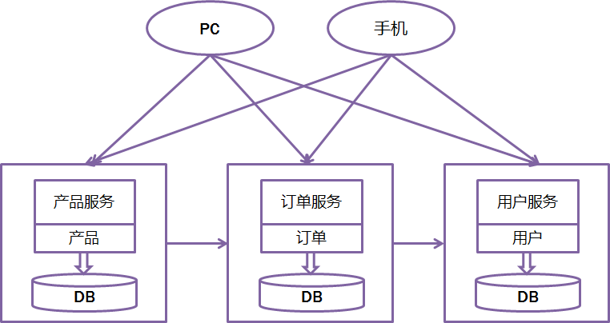

# ✅什么是微服务架构？优势？特点？

[https://developer.aliyun.com/article/2764](https://developer.aliyun.com/article/2764)（这篇文章写的很好，好几年前是在我司内网看到的，后来在外网也发布了，我最初理解微服务就是通过这篇文章的）

****

# 典型回答

微服务（Microservices）是一种软件架构风格，用于构建复杂的应用程序。它将一个大型的应用程序拆分成一组小型、独立的服务单元，每个服务单元都可以独立部署、运行和扩展。每个微服务都专注于执行一个特定的业务功能，并通过轻量级的通信机制（如HTTP、RPC、MQ等）来相互调用。

微服务的目的是有效的拆分应用，实现敏捷开发和部署 。

比如把一个原来中心化的商城服务，拆分成产品服务、订单服务及用户服务，每一个服务把功能内聚，系统间通过远程调用解耦。实现高内聚低耦合。

并且每一个服务都可以独立的提供子服务。并且他们有自己的应用、自己的存储，是独立的，互不影响的。

  

而且，拆分后的不同的服务可以使用不同的技术栈，因为它们是独立的。这使得团队可以选择最适合其需求的技术来构建服务。

并且做了服务拆分之后，也能提升迭代速度，至少产品服务的变更不会对订单服务有任何影响。大家可以并行开发，快速迭代。

# 扩展知识

## SOA和微服务

[✅SOA和微服务之间的主要区别是什么？](https://www.yuque.com/hollis666/dr9x5m/fkg3572ih9pye728)

## 微服务和分布式

[✅分布式和微服务的区别是什么？](https://www.yuque.com/hollis666/dr9x5m/av4fdpxuxauxym6k)

## 微服务和康威定律

[✅什么是康威定律？](https://www.yuque.com/hollis666/dr9x5m/rcgubon7keglqt75)

> 更新: 2024-07-08 12:11:54  
> 原文: <https://www.yuque.com/hollis666/dr9x5m/zao7sn0kve58xasr>