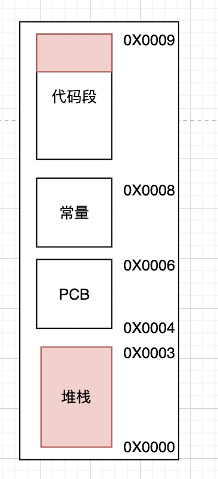

# ✅什么是分段和分页？

# 典型回答

在操作系统中，分段和分页是两种不同的内存管理技术，用于管理和分配进程的内存空间。它们的主要目标是提供对物理内存的有效和安全访问，但它们采用了不同的方法来实现这一目标。

## 分页
大部分虚拟内存系统都会使用分页技术。分页技术把物理内存按照固定大小分为页面（一般是4KB）。通过分页，我们可以更细粒度的管理物理内存和虚拟空间的映射，也可以更高效的利用物理内存。对于一个64KB的虚拟地址和32KB的物理地址来说，如下图所示：

如果用户访问到的虚拟地址还没有分配物理地址，那么系统就会发生缺页中断。将需要访问的页面装载到页框中，修改MMU中的映射关系，重新返回。

### 页表

对于虚拟地址和物理地址的映射关系的存储，我们一般是通过页表来完成的。页表中会记录虚拟地址的虚拟页号和偏移量，以及其对应的实际页框号。从数学角度说，页表是一个函数，它的参数是虚拟页号，结果是物理页框号。

同时，因为增加了页表的映射，中间就一定会有空间和时间的损耗，有两个问题：

1. 虚拟地址到物理地址的映射需要时间，这个时候就需要引入快表（TLB）加速页表的访问。
2. 如果虚拟地址空间很大，页表也会很大，可能会浪费空间。假设64bit的操作系统，虚拟地址的大小为2^64，如果每页是4KB，那么需要的记录数就是2^64/2^12=2^52项。同时，因为每个进程都有一个独立的虚拟地址，所以每个进程都有自己独立的页表，那么这种情况下，记录的项目就会变得非常多

对于第二种情况，我们可以采用多级页表和倒排页表的方式来解决。

多级页表的核心就在于避免把所有的页表全部保存在内存中，如果是不需要的页表，就不会保留。

倒排页表常用于64bit的计算机中，往往需要和TLB结合使用才可以。

## 分段

有了分页之后，一个进程就可以享受很大的，独立的虚拟地址了。但是有一个问题我们没有考虑到，一个进程中一定会包含代码，常量，以及代码在运行时所产生的变量。那么，用户的程序如何保证这些代码所在的空间不和代码运行时候的堆栈空间冲突呢？

如果我们只是简单的将虚拟内存按照一维的方式将空间分给这些堆栈，代码片段等，就很难保证空间的有效利用，如下图所示：

此时，我们发现，程序的堆栈空间已经用完了，但是代码段还有很多没有用。这个时候就需要程序手动管理这些一维空间，无疑的比较复杂且困难的。

所以就有了分段技术的产生。它可以让每个段独享一部分可以自然增长的空间，且和其他段相互隔离，如下所示：

## 
## 分段分页的区别
| 关联点 | 分页 | 分段 |
| --- | --- | --- |
| 程序猿是否感知 | 否 | 是 |
| 地址空间是否可以超过物理空间 | 是 | 是 |
| 不同用户是否方便共享 | 否 | 是 |
| 是否定长 | 是 | 否 |
| 发明原因 | 获得更大的线性地址空间 | 使程序和数据被划分为逻辑上独立的空间 |

> 更新: 2024-07-08 12:11:38  
> 原文: <https://www.yuque.com/hollis666/dr9x5m/frgrhdunf6fghhg5>