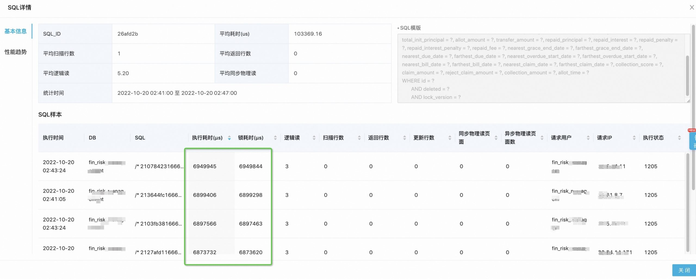

# ✅数据库连接池满排查过程

之前一段时间，业务在线上经常出现频繁的数据库连接池满的报警，报错信息如下：

<font style="color:rgb(85, 85, 85);"></font>

```plain
Caused by: ERR-CODE: [TDDL-4103][ERR_ATOM_CONNECTION_POOL_FULL] 
Pool of DB 'cn-zhxxx_i-xxx_fin_risk_xxx_30xx:33.10.xxx.xx:30xx' is full. 
Message from pool: wait millis 5000, active 10, maxActive 10. 
AppName:FIN_RISK_xxx_APP, Env:ONLINE, UnitName:null. 
```


然后去排查了一下SQL耗时，发现有大量的耗时SQL，并且执行耗时和锁耗时差不多是相等的。（公司内部工具）




<font style="color:rgb(85, 85, 85);">然后看下这条具体的SQL语句：</font>

```plain
UPDATE collection_case 
SET gmt_modified = now(), lock_version = lock_version + ?, hands_count = ?, case_state = ?,  max_ovd_days = ?, case_class = ?, cur_ovd_principal = ?,collection_amount = ? 
WHERE id = ?   AND deleted = ?   AND lock_version = ? 
```

<font style="color:rgb(85, 85, 85);">其实就是简单的一个更新语句，其中使用了乐观锁进行并发控制。</font>

<font style="color:rgb(85, 85, 85);"></font>

<font style="color:rgb(85, 85, 85);">为什么乐观锁还会导致大量的锁耗时呢？</font>

<font style="color:rgb(85, 85, 85);"></font>

**<font style="color:rgb(85, 85, 85);">虽然乐观锁是不需要加锁的，通过CAS的方式进行无锁并发控制进行更新的。但是InnoDB的update语句是要加锁的。当并发冲突比较大，发生热点更新的时候，多个update语句就会排队获取锁。</font>**

**<font style="color:rgb(85, 85, 85);"></font>**

<font style="color:rgb(85, 85, 85);">而这个排队的过程就会占用数据库链接，一旦排队的事务比较多的时候，就会导致数据库连接被耗尽。</font>

<font style="color:rgb(85, 85, 85);"></font>

<font style="color:rgb(85, 85, 85);">这类问题的解决思路有以下几个：</font>

<font style="color:rgb(85, 85, 85);"></font>

+ <font style="color:rgb(85, 85, 85);">1、基于缓存进行热点数据更新，如Redis。</font>
+ <font style="color:rgb(85, 85, 85);">2、通过异步更新的方式，将高并发的更新削峰填谷掉。</font>
+ <font style="color:rgb(85, 85, 85);">3、将热点数据进行拆分，分散到不同的库、不同的表中，减少并发冲突。</font>
+ <font style="color:rgb(85, 85, 85);">4、合并更新请求，通过批量执行的方式来降低冲突。（比如你有10条增加积分的操作要执行，那么你就可以算出这十条一共要加多少积分，一次性加上去）</font>

<font style="color:rgb(85, 85, 85);"></font>

<font style="color:rgb(85, 85, 85);">其中，第2个和第4个方案，存在一定的延迟性，会把实时更新变更异步更新，存在一定的数据实时性问题。</font>

<font style="color:rgb(85, 85, 85);"></font>

<font style="color:rgb(85, 85, 85);">第1个和第3个方案，实现起来成本比较高，但是相对来说更加完整一点。</font>

<font style="color:rgb(85, 85, 85);"></font>

<font style="color:rgb(85, 85, 85);">根据我们的实际业务场景，我们选择了第4个方案，将更新操作进行合并，批量执行。</font>

<font style="color:rgb(85, 85, 85);"></font>

<font style="color:rgb(85, 85, 85);">比如本来需要100个并发都给用户增加积分，那么改成10分钟更新一次，一次就把10分钟中内的所有需要增加的积分汇总之后一次更新用户积分表即可。</font>

<font style="color:rgb(85, 85, 85);"></font>

<font style="color:rgb(85, 85, 85);">这个方案的实现细节可以参考：</font>

<font style="color:rgb(85, 85, 85);"></font>

[✅MySQL怎么做热点数据高效更新？](https://www.yuque.com/hollis666/dr9x5m/rfqcbz190k9egley)


> 更新: 2024-07-08 12:11:48  
> 原文: <https://www.yuque.com/hollis666/dr9x5m/dlz4xagyghoys4p8>