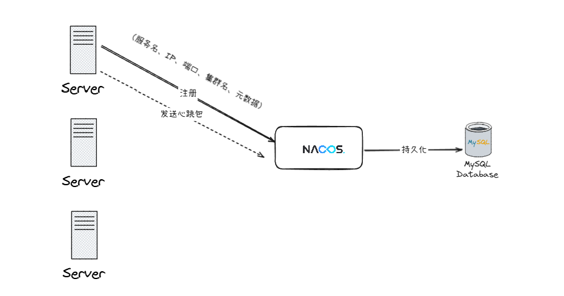
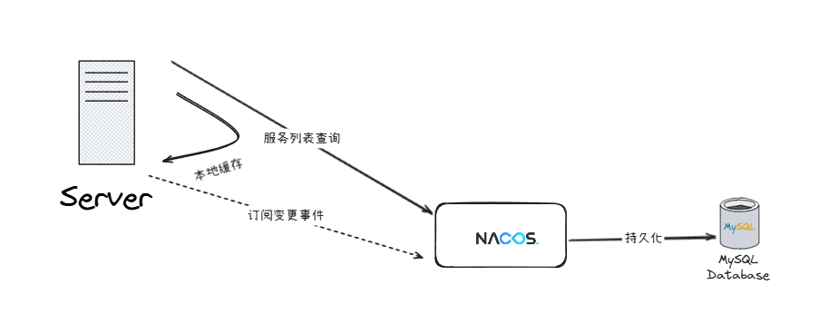
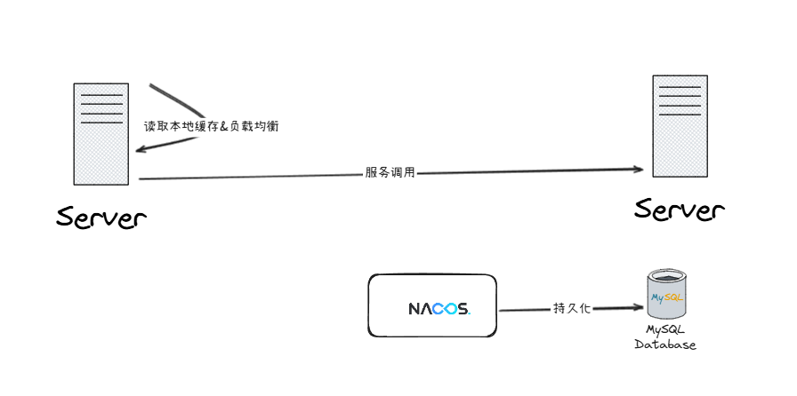

# ✅Nacos的服务注册和服务发现的过程是怎么样的？

# 典型回答

首先说**服务注册**，所谓服务注册，就是把服务给注册到nacos的注册中心上面去，让nacos知道自己是提供某个服务的。

服务注册时发生在服务实例（如订单服务）启动时，通过Nacos客户端向Nacos Server发送注册请求，包含服务名、IP、端口、集群名、元数据等信息。

Nacos Server将实例信息存入持久化存储（如内嵌数据库Derby或外置MySQL），并同步至集群其他节点（基于Raft协议保证一致性）。

  
注册后，实例定期（默认5秒）向Nacos发送心跳包，维持健康状态。若15秒内无心跳，实例被标记为不健康；30秒未收到则删除实例。 

继续说**服务发现**，服务发现指的是通过nacos来发现对应的服务都有哪些提供者。服务发现有两种方式，一种是主动查询，

****

首次调用前，消费者客户端向 Nacos Server 发起一次查询，获取目标服务的全量实例列表。结果缓存到本地，并订阅该服务的变更事件。

后续调用时，直接读取本地缓存，根据负载均衡策略（如随机、轮询、权重）选择一个实例发起调用。

为了保证本地缓存的实时性，客户端默认每隔 10 秒（可通过 `nacos.client.naming.pull.interval=10000` 配置）主动向 Nacos Server 拉取最新服务列表，覆盖旧缓存。

另外，当 Nacos Server 检测到服务实例变化（如注册、下线、健康状态变更），会通过 UDP 或 gRPC 主动推送变更事件到订阅的客户端。客户端收到推送后立即更新本地缓存，无需等待定时拉取，实现秒级更新。

> 更新: 2025-03-02 16:01:50  
> 原文: <https://www.yuque.com/hollis666/dr9x5m/ltuskw2pcxdns2i5>