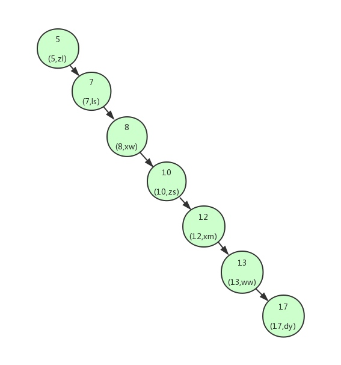

# ✅为什么在JDK8中HashMap要转成红黑树

# 典型回答
## 为什么不继续使用链表


我们知道，HashMap解决hash冲突是通过拉链法完成的，在JDK8之前，如果产生冲突，就会把新增的元素增加到当前桶所在的链表中。


**这样就会产生一个问题，当某个bucket冲突过多的时候，其指向的链表就会变得很长，这样如果put或者get该bucket上的元素时，复杂度就无限接近于O(N)，这样显然是不可以接受的。**


所以在JDK1.7的时候，在元素put之前做hash的时候，就会充分利用扰动函数，将不同KEY的hash尽可能的分散开。不过这样做起来效果还不是太好，所以当链表过长的时候，我们就要对其数据结构进行修改


## 为什么是红黑树


当元素过多的时候，用什么来代替链表呢？我们很自然的就能想到可以用二叉树查找树代替，所谓的二叉查找树，一定是left < root < right，这样我们遍历的时间复杂度就会由链表的O(N)变为二叉查找树的O(logN)，二叉查找树如下所示：


但是，对于极端情况，当子节点都比父节点大或者小的时候，二叉查找树又会退化成链表，查询复杂度会重新变为O(N)，如下所示：





所以，我们就需要**二叉平衡树（AVL树）**出场，他会在每次插入操作时来检查**每个节点的左子树和右子树的高度差至多等于1**<font style="color:rgb(0, 0, 0);">，</font>如果>1，就需要进行左旋或者右旋操作，使其查询复杂度一直维持在O(logN)。

<font style="color:rgb(0, 0, 0);"></font>

但是这样就万无一失了吗？其实并不然，我们不仅要保证查询的时间复杂度，还需要保证插入的时间复杂度足够低，因为平衡二叉树要求高度差最多为1，非常严格，导致每次插入都需要左旋或者右旋，极大的消耗了插入的时间。


对于那些插入和删除比较频繁的场景，AVL树显然是不合适的。为了保证查询和插入的时间复杂度维持在一个均衡的水平上，所以就引入了红黑树。


在红黑树中，所有的叶子节点都是黑色的空节点，也就是叶子节点不存数据；任何相邻的节点都不能同时为红色，红色节点是被黑色节点隔开的，每个节点，从该节点到达其可达的叶子节点的所有路径，都包含相同数目的黑色节点。


我们可以得到如下结论：**红黑树不会像AVL树一样追求绝对的平衡，它的插入最多两次旋转，删除最多三次旋转，在频繁的插入和删除场景中，红黑树的时间复杂度，是优于AVL树的。**


综上所述，这就是HashMap选择红黑树的原因。

# 知识扩展


## 为什么是链表长度达到8的时候转
这个问题有两层含义，第一个是为什么不在冲突的时候立刻转为红黑树，第二个是为什么是达到8的时候转


### 为什么不在冲突的时候立刻转
原因有2，从空间维度来讲，因为红黑树的空间是普通链表节点空间的2倍，立刻转为红黑树后，太浪费空间；从时间维度上讲，红黑树虽然查询比链表快，但是插入比链表慢多了，每次插入都要旋转和变色，如果小于8就转为红黑树，时间和空间的综合平衡上就没有链表好


### 为什么长度为8的时候转
先来看源码的一段注释：

```java
/* Because TreeNodes are about twice the size of regular nodes, we
* use them only when bins contain enough nodes to warrant use
* (see TREEIFY_THRESHOLD). And when they become too small (due to
* removal or resizing) they are converted back to plain bins.  In
* usages with well-distributed user hashCodes, tree bins are
* rarely used.  Ideally, under random hashCodes, the frequency of
* nodes in bins follows a Poisson distribution
* (http://en.wikipedia.org/wiki/Poisson_distribution) with a
* parameter of about 0.5 on average for the default resizing
* threshold of 0.75, although with a large variance because of
* resizing granularity. Ignoring variance, the expected
* occurrences of list size k are (exp(-0.5) * pow(0.5, k) /
* factorial(k)). The first values are:
*
* 0:    0.60653066
* 1:    0.30326533
* 2:    0.07581633
* 3:    0.01263606
* 4:    0.00157952
* 5:    0.00015795
* 6:    0.00001316
* 7:    0.00000094
* 8:    0.00000006
* more: less than 1 in ten million
 */
```


大概的翻译就是TreeNode占用的内存是Node的两倍，只有在node数量达到8时才会使用它，而当 node 数量变小时（删除或者扩容），又会变回普通的 Node 。当 hashCode遵循泊松分布时，因为哈希冲突造成桶的链表长度等于8的概率只有0.00000006 。官方认为这个概率足够的低，所以指定链表长度为 8 时转化为红黑树。所以 8 这个数是经过数学推理的，不是瞎写的。

<font style="color:rgb(85, 85, 85);"></font>

### 为什么长度为6的时候转回来？


但是，当红黑树节点数小于 6 时，又会把红黑树转换回链表，**这个设计的主要原因是出于对于性能和空间的考虑**。前面讲过为什么直接用红黑树，那同理，转成红黑树之后总要在适当的时机转回来，要不然无论是空间占用大，而且插入性能都会下降。


8的时候转成红黑树，那么如果小于8立刻转回去，那么就可能会导致频繁转换，所以要选一个小于8的值，但是又不能是7。而通过前面提到的泊松分布可以看到，当红黑树节点数小于 6 时，它所带来的优势其实就是已经没有那么大了，就不足以抵消由于红黑树维护节点所带来的额外开销，此时转换回链表能够节省空间和时间。


但是不管怎样，6 这个数值是通过大量实验得到的经验值，在绝大多数情况下取得比较好的效果。


## 双向链表是怎么回事
HashMap红黑树的数据结构中，不仅有常见的parent，left，right节点，还有一个next和prev节点。这很明显的说明，其不仅是一个红黑树，还是一个双向链表，为什么是这样呢？


这个其实我们也在之前红黑树退化成链表的时候稍微提到过，红黑树会记录树化之前的链表结构，这样当红黑树退化成链表的时候，就可以直接按照链表重新链接的方式进行（详细分析可以见前面扩容的文章）


不过可能有人会问，那不是需要一个next节点就行了，为什么还要prev节点呢？这是因为当删除红黑树中的某个节点的时候，这个节点可能就是原始链表的中间节点，如果把该节点删除，只有next属性是没办法将原始的链表重新链接的，所以就需要prev节点，找到上一个节点，重新成链

## HashMap的元素没有比较能力，红黑树为什么可以比较？
这里红黑树使用了一个骚操作：


1. 如果元素实现了comparable接口，则直接比较，否则
2. 则使用默认的仲裁方法，该方法的源码如下：

```java
static int tieBreakOrder(Object a, Object b) {
    int d;
    if (a == null || b == null ||
        (d = a.getClass().getName().
         compareTo(b.getClass().getName())) == 0)
        d = (System.identityHashCode(a) <= System.identityHashCode(b) ?
             -1 : 1);
    return d;
}
```


> 更新: 2024-07-08 12:11:34  
> 原文: <https://www.yuque.com/hollis666/dr9x5m/zx609g>