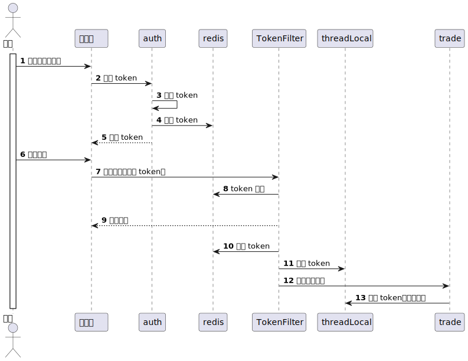

# ✅基于Token校验避免订单重复提交

### （本方案来自我的[数藏项目](https://www.yuque.com/hollis666/dr9x5m/dgolk0cckpb94sia)，相关视频讲解及完整项目代码，在项目课中均有讲解）


在很多秒杀场景中，用户为了能下单成功，会频繁的点击下单按钮，这时候如果没有做好控制的话，就可能会给一个用户创建重复订单。


那么，我们如何防止这个问题呢？


其实有一个好办法，那就是用户在下单的时候，带一个 token 过来，我们校验这个 token 的有效性，如果 token 有效，则允许下单，如果无效，则不允许用户下单。


这里的 token 也不是 sa-token（单点登录框架） 发放的，而是我们自己实现的一个发放和存储，以及后续的校验，都是我们自己做的。




那么，这个 token 是如何发放和校验的的呢？


token 的发放比较简单，我们定义一个 controller，在下单页面渲染的时候从接口中获取一下就行了。


```plain
/**
 * @author hollis
 */
@Slf4j
@RequiredArgsConstructor
@RestController
@RequestMapping("token")
public class TokenController {

    private static final String TOKEN_PREFIX = "token:";

    @Autowired
    private RedisTemplate redisTemplate;

    @GetMapping("/get")
    public Result<String> get(@NotBlank String scene) {
        if (StpUtil.isLogin()) {
            String token = UUID.randomUUID().toString();
            redisTemplate.opsForValue().set(TOKEN_PREFIX + scene + CACHE_KEY_SEPARATOR + token, "token", 30, TimeUnit.MINUTES);
            return Result.success(TOKEN_PREFIX + scene + CACHE_KEY_SEPARATOR + token);
        }
        throw new AuthException(AuthErrorCode.USER_NOT_LOGIN);
    }
}
```

以上，就是一个 token 获取的接口，通过用户传入的scene ，我们生产了一个 token 并把它存储在 redis 中。并返回给前端。


前端在拿到这个 token 后，需要再下单接口中把这个 token 带过来，然后我们在后端判断一下他的有效性。 token 的校验我们是通过Filter 实现的，这样做更加通用一些。


```plain
/**
 * @author Hollis
 */
public class TokenFilter implements Filter {

    private static final Logger logger = LoggerFactory.getLogger(TokenFilter.class);

    private RedissonClient redissonClient;

    public TokenFilter(RedissonClient redissonClient) {
        this.redissonClient = redissonClient;
    }

    @Override
    public void init(FilterConfig filterConfig) throws ServletException {
        // 过滤器初始化，可选实现
    }

    @Override
    public void doFilter(ServletRequest request, ServletResponse response, FilterChain chain) throws IOException, ServletException {
        HttpServletRequest httpRequest = (HttpServletRequest) request;
        HttpServletResponse httpResponse = (HttpServletResponse) response;

        // 从请求头中获取Token
        String token = httpRequest.getHeader("Authorization");

        if (token == null) {
            httpResponse.setStatus(HttpServletResponse.SC_UNAUTHORIZED);
            httpResponse.getWriter().write("No Token Found ...");
            logger.error("no token found in header , pls check!");
            return;
        }

        // 校验Token的有效性
        boolean isValid = checkTokenValidity(token);

        if (!isValid) {
            httpResponse.setStatus(HttpServletResponse.SC_UNAUTHORIZED);
            httpResponse.getWriter().write("Invalid or expired token");
              logger.error("token validate failed , pls check!");
            return;
        }

        // Token有效，继续执行其他过滤器链
        chain.doFilter(request, response);
    }

    private boolean checkTokenValidity(String token) {
        String luaScript = """
                local value = redis.call('GET', KEYS[1])
                redis.call('DEL', KEYS[1])
                return value""";

        // 6.2.3以上可以直接使用GETDEL命令
        // String value = (String) redisTemplate.opsForValue().getAndDelete(token);

        Object result = redissonClient.getScript().eval(RScript.Mode.READ_WRITE,
                luaScript,
                RScript.ReturnType.VALUE,
                Arrays.asList(token));

        return result != null;
    }

    @Override
    public void destroy() {
    }
}
```

主要实现在doFilter方法中，主要是判断请求中是否携带了 token，如果携带了，通过 redis 校验 token 是否有效，如果有效，则把这个 token 删除，并且放过请求。如果无效，则直接拒绝请求。


这里的token 校验及移除，我们是通过 lua 脚本实现的，保证原子性。


有了这个 filter 之后，我们需要让他能够生效，则需要以下配置：

```plain
/**
 * @author Hollis
 */
@AutoConfiguration
@ConditionalOnWebApplication
public class WebConfiguration implements WebMvcConfigurer {

    @Bean
    @ConditionalOnMissingBean
    GlobalWebExceptionHandler globalWebExceptionHandler() {
        return new GlobalWebExceptionHandler();
    }
    
    @Bean
    public FilterRegistrationBean<TokenFilter> tokenFilter(RedissonClient redissonClient) {
        FilterRegistrationBean<TokenFilter> registrationBean = new FilterRegistrationBean<>();

        registrationBean.setFilter(new TokenFilter(redissonClient));
        registrationBean.addUrlPatterns("/trade/buy");
        registrationBean.setOrder(10);

        return registrationBean;
    }
```

这里，我们并不是给所有的页面都加这个 token 的校验，其实很多接口是不需要的，所以我们只需要通过registrationBean.addUrlPatterns("/trade/buy");设置上我们需要校验的路径就行了。


### （本项目亮点来自我的[数藏项目](https://www.yuque.com/hollis666/dr9x5m/dgolk0cckpb94sia)文档中的最佳实践部分，更多项目亮点难点（50+），更详细的落地方案和讲解，可以在项目课中和我们一起学）


> 更新: 2025-05-05 18:28:47  
> 原文: <https://www.yuque.com/hollis666/dr9x5m/pwcy754u79o8h9a1>