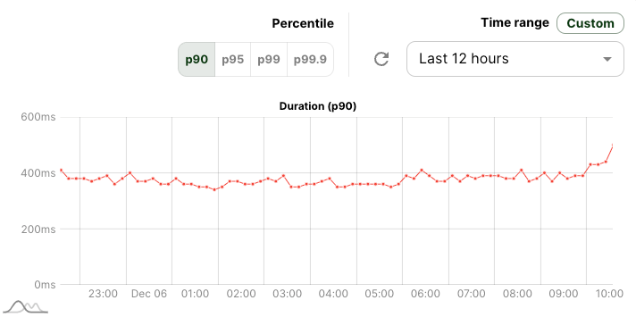

# ✅说下什么是p90，p95，P99？

# 典型
P90、P95 和 P99 这些术语，常见于性能测试、响应时间分析、统计分析等领域，这是一种统计学中的百分位数（percentile）的表达方式，用来描述数据集中不同分布位置的数据点。

> 百分位数表示一个数值在一组数据中的相对位置。例如，第X百分位数（P_X）指的是一组数据中有X%的数据点小于或等于该数值，剩下的(100-X)%的数据点大于该数值。
>

+ **P90（第90百分位数）**：表示90%的数据点小于或等于该值，剩下的10%的数据点大于这个值。比如在性能测试中，如果系统的响应时间的P90是500毫秒，那么意味着90%的请求响应时间小于或等于500毫秒，只有10%的请求响应时间超过500毫秒。

+ **P95（第95百分位数）**：表示95%的数据点小于或等于该值，剩下的5%大于该值。P95常用于识别性能问题中的“尾部延迟”，即大部分请求响应速度良好，但有一小部分请求响应时间过长。

+ **P99（第99百分位数）**：表示99%的数据点小于或等于该值，剩下的1%大于该值。P99通常用来衡量系统中极少数极端慢的请求，这些请求可能由资源瓶颈或特殊情况引起。

这些百分位数常用于衡量系统性能、延迟、响应时间等数据的分布，特别是为了了解系统在**尾部表现**如何，即关注那些极端的、不常见的、但会影响用户体验的慢请求或问题。

+ **P50**：也称为中位数，表示50%的数据点小于或等于这个值，用来衡量整体表现。
+ **P90、P95**：常用于识别系统的高延迟部分，能帮助发现大多数用户的体验情况和少数不良表现的趋势。
+ **P99**：通常用于观察极端情况，特别是在高并发环境中，尾部请求的响应时间可能显著拖慢系统性能。

### 举个例子：
假设有一组请求响应时间（单位：毫秒）为：

`[100, 120, 130, 140, 150, 160, 170, 180, 190, 200, 210, 220, 230, 240, 250]`

+ **P90**：第90百分位数是225毫秒，意味着90%的请求响应时间小于或等于225毫秒，10%的请求大于225毫秒。
+ **P95**：第95百分位数是235毫秒，意味着95%的请求响应时间小于或等于235毫秒，5%的请求大于235毫秒。
+ **P99**：第99百分位数是245毫秒，意味着99%的请求响应时间小于或等于245毫秒，只有1%的请求大于245毫秒。

通过这种方式，可以评估和优化系统的性能，并找到优化的瓶颈。

> 更新: 2024-09-28 12:49:22  
> 原文: <https://www.yuque.com/hollis666/dr9x5m/nz2cp6vbkexabpma>